# 亚瑟 AX1800Pro & 兆能M2 进阶教程

!>进阶教程部分内容可能会出现不可意料的后果，请谨慎操作！

## 亚瑟利用剩余磁盘空间

!>请勿操作教程中未提到的任何分区，否则可能导致系统出现严重问题

!>本帖仅适用于亚瑟用户，兆能用户请勿操作！

进入后台-系统-软件包
先点击刷新列表，然后再可用软件包中搜索cfdisk

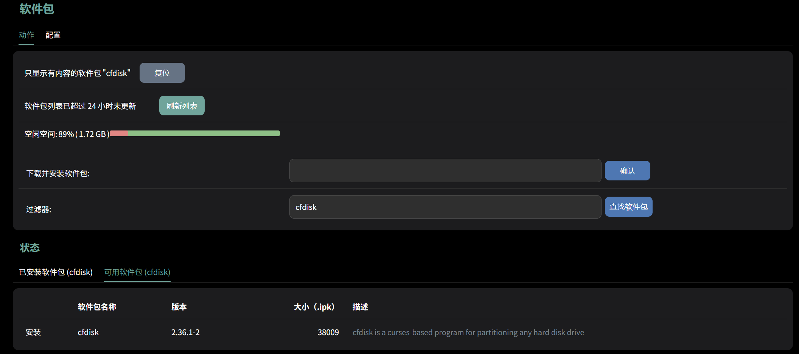

点击安装

然后进入后台-系统-TTYD 终端 （或者进入SSH）

输入后台账号密码登录
输入`fdisk -l`

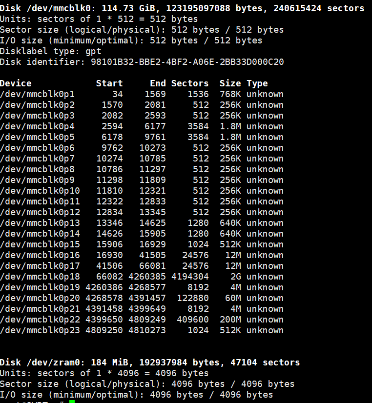

会有类似上图的输出，可以看到mmcblk0有100多GB（以机器实际版本为准）但是实际下面的分区中仅仅使用了几个GB

然后输入`cfdisk /dev/mmcblk0`

进入cfdisk界面

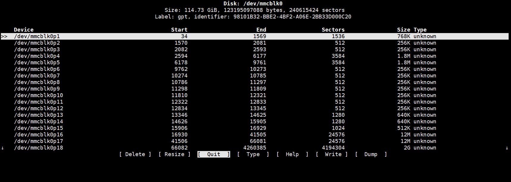

按键盘下键，使光标移动到Free space，按键盘左右键使得下面的光标移动到New，然后回车

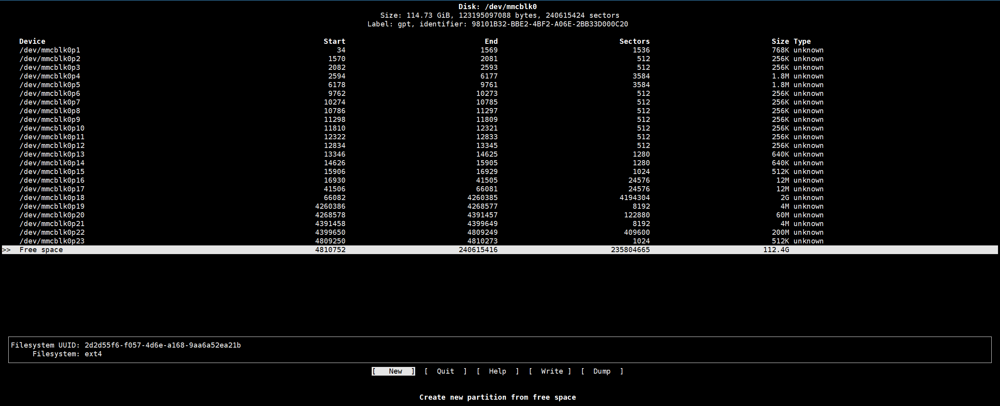

然后会出现Partition size，设置分区大小，默认是所有未分区的大小，如果不需要修改直接回车即可

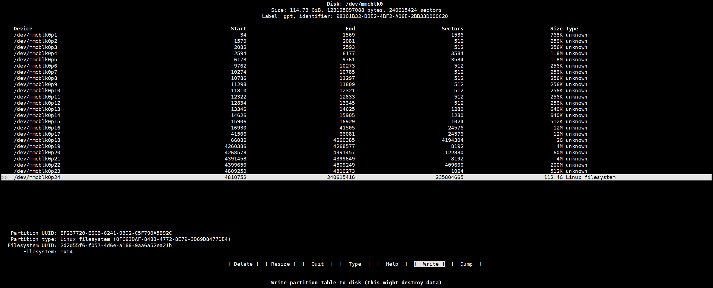

然后按键盘左右键使得下方光标移动到Write，回车

然后输入`yes`确认

再将下光标移动到Quit，回车即可

设置完毕后，再通过`fdisk -l`命令可以看到一个/dev/mcblk0p24 的分区

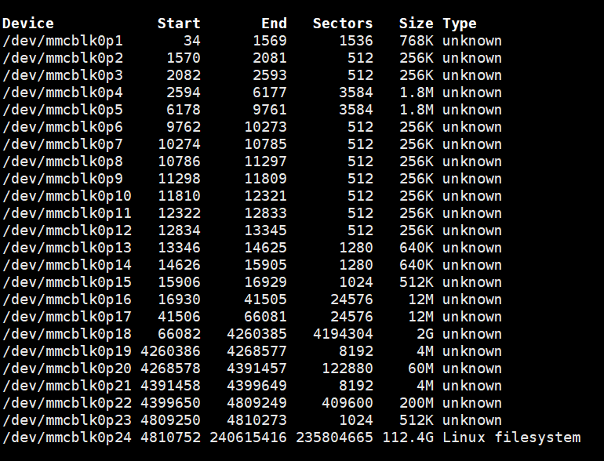

接下来通过`mkfs.ext4 /dev/mmcblk0p24`命令格式化这个分区（/dev/mmcblk0p24为上方所看到的分区名字）

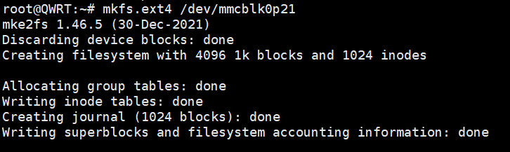

输出上面的内容就是成功了

接下来，进入后台-系统-挂载点

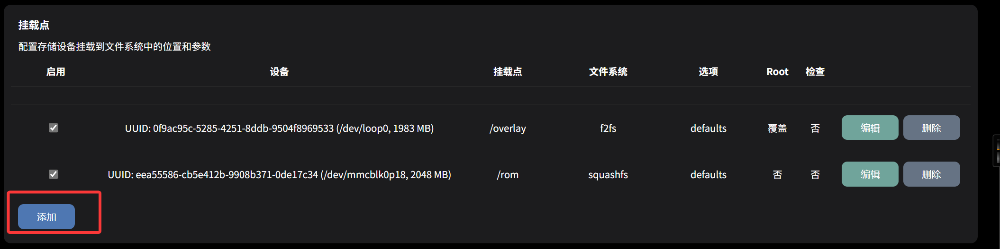

点击添加

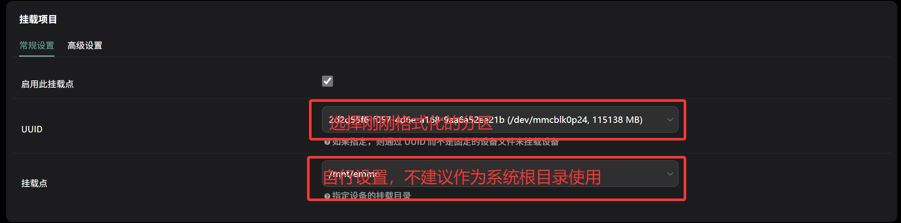

挂载点如果不知道设置什么，可以设置`/mnt/xxxxx`(xxxx内容自行指定)
如果需要作为docker的数据分区，选择作为 Docker 数据分区使用（/opt）即可

然后点击保存&应用，这个分区就会挂载到你选择的挂载点下了

以上设置完毕后，重启系统（后台-系统-重启）

## 将某个LAN口划为WAN口

*注意：多wan口同时使用需要配置MWAN3，否则会有一些奇奇怪怪的问题发生（本网站MWAN3配置教程还在todo，所以配置教程请自行百度）*

进入后台-网络-接口 编辑LAN口

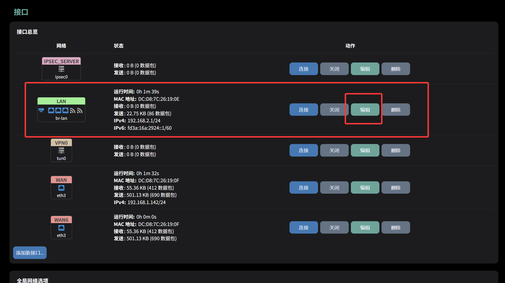

进入物理设置

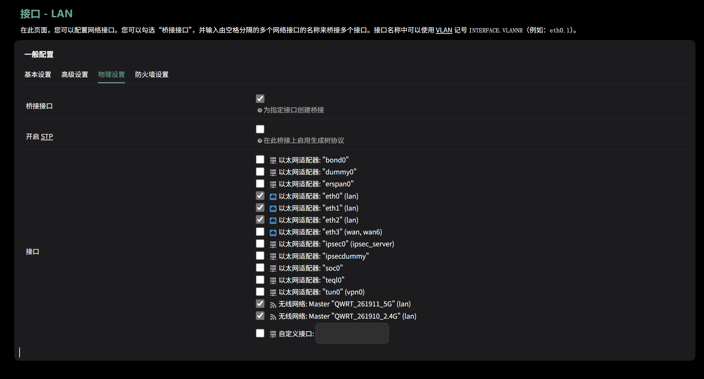

目前LAN口绑定了eth0 1 2 三个网口，取消勾选你需要设置为WAN口的接口（离wan口最近的LAN口为eth2，后面依次为eth1 eth0）

然后点击保存&应用

回到网络-接口 点击添加新接口

接口选择时选择需要作为WAN口的接口

接口协议：（一般没有特殊需求就是选择DHCP客户端）

- DHCP 客户端：通过DHCP协议自动获取ipv4，上游网关，dns等信息，并连接互联网
- DHCPv6 客户端：通过DHCP协议自动获取ipv6，上游网关，dns等信息，并连接互联网
- 不配置协议：一般用不到
- PPP 和 PPPoE 协议不做介绍，需要使用的自行探索（实际上是我没用过）
- 静态地址：可以手动指定内网ip地址 子网掩码 网关等信息

然后点击提交

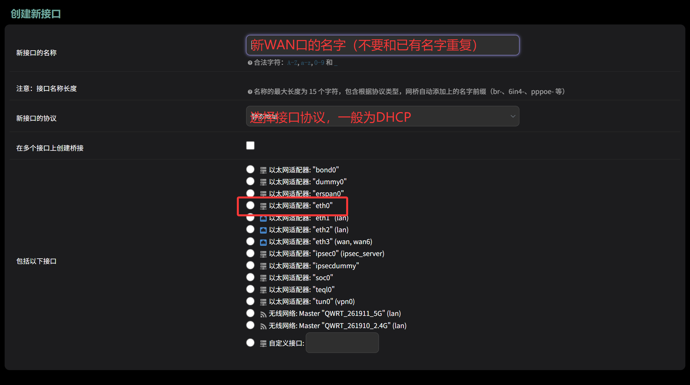

如果协议选择为DHCP，在提交后需要点击下方的配置DHCP服务器

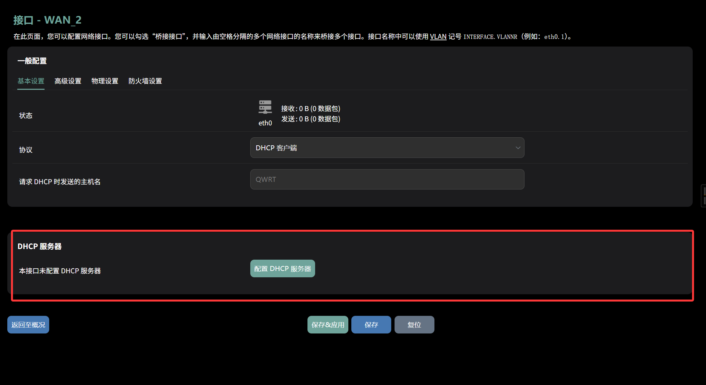

然后点击防火墙设置

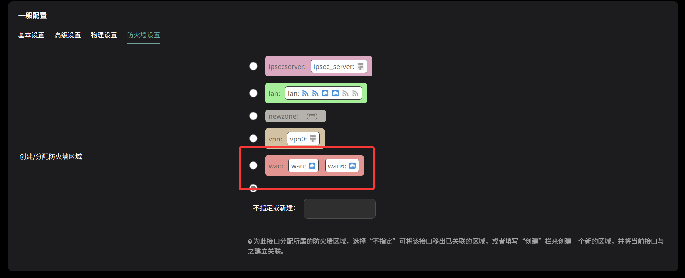

将该接口防火墙划入WAN中

然后点击保存&应用即可

## 使用MWAN3实现多WAN聚合

进入后台-系统-软件包 点击刷新列表

安装`luci-app-mwan3`然后路由器后台会自动退出登录

重新进入后台-系统-软件包安装` luci-i18n-mwan3-zh-cn`

### 接口配置

进入后台-网络-负载均衡

接口页面默认会有`wan` `wan6` `wanb` `wanb6`后两个可以删除，或者全部删除重新配置

在图中位置填入接口名，接口名与网络-接口中的名字一致（如`wan`）

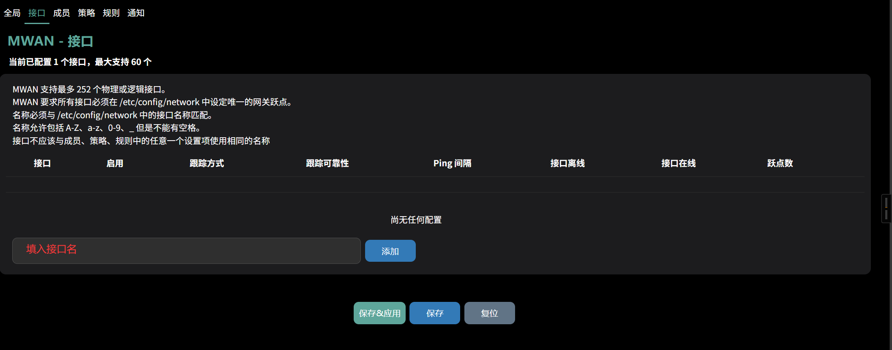

然后修改以下配置

互联网协议地址：根据接口类型选择（如wan口为ipv4则选择ipv4）

跟踪的主机或地址：用于判断接口是否在线，可填写运营商DNS或者公共DNS（如223.5.5.5 180.76.76.76等）

保持故障检测间隔：建议打开，否则接口离线后不会自动恢复

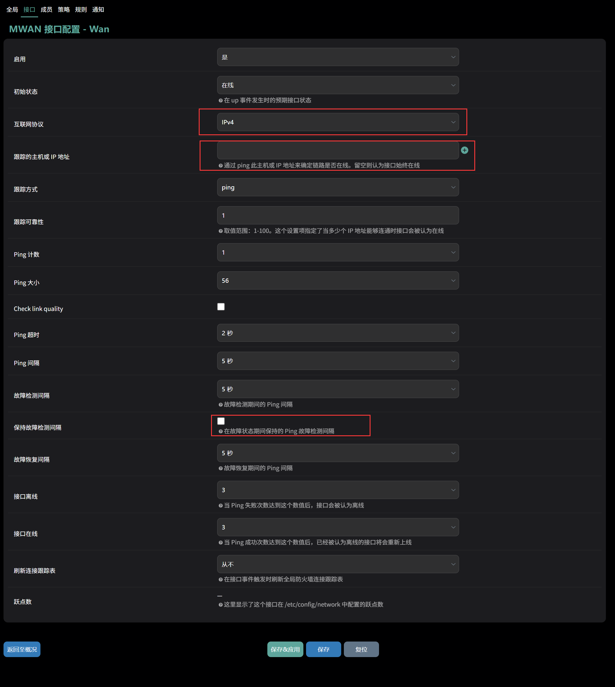

配置完后，点击保存（建议先保存最后配置完成后再统一保存&应用）

由于接口默认不配置跃点数，所以接下来进入网络-接口，编辑刚刚配置的接口（如WAN）

点击高级设置，在使用网关越点中填写一个数值(从1开始，数值越小，网关优先级越高，但该值不得与其他接口重复)

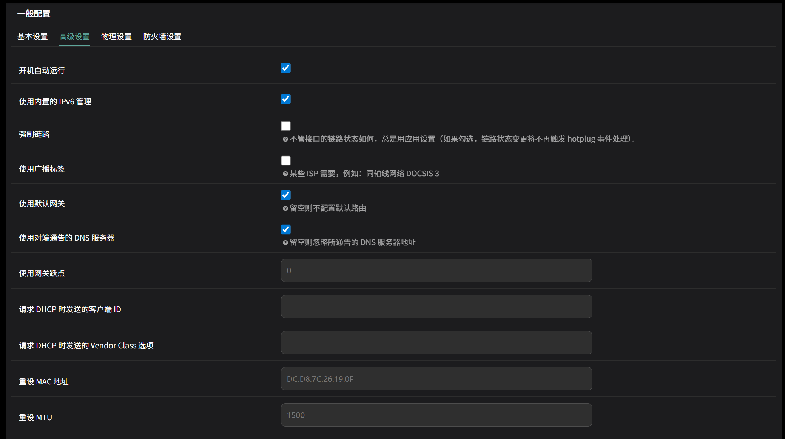

配置完后，点击保存

其他接口请重复上述配置过程

### 成员配置

进入接口-负载均衡-成员

删除所有默认成员，然后填入成员名（自行指定但是不得与接口名字重复）然后点击添加

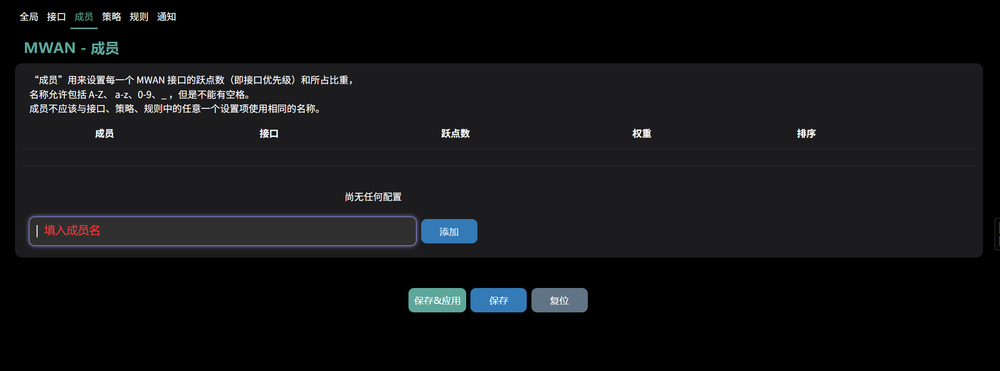

接口选择该成员对应的接口（正常来说一个成员对应一个接口即可）

跃点数：越小优先级越高，但此处规则与刚刚不同，可以与接口的跃点数不同

如果在此处存在多个接口成员，且成员的跃点数不同，会优先使用跃点数最小的接口成员，除非跃点数最小的接口成员离线，否则不会使用跃点数更高的接口成员。如果希望使用所有接口成员，可以将所有接口成员跃点数设置为相同值。

权重：对于跃点数相同的接口，会为权重更高的接口成员分配更多流量。

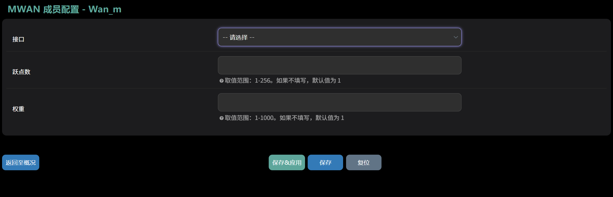

配置完后点击保存

其他接口的成员请重复上述配置过程

### 策略配置

进入接口-负载均衡-策略

删除除去`Balanced`以外的所有策略

编辑`Balanced`策略

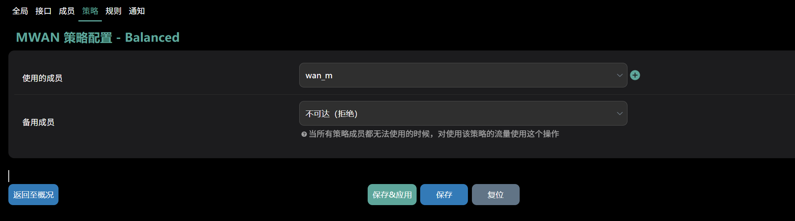

使用的成员选择你刚刚添加的所有成员，备用成员不动，然后点击保存

如果你不需要后续配置了且刚刚你的所有配置均只点了保存，在最后需要点击右上方的图标然后点击保存&应用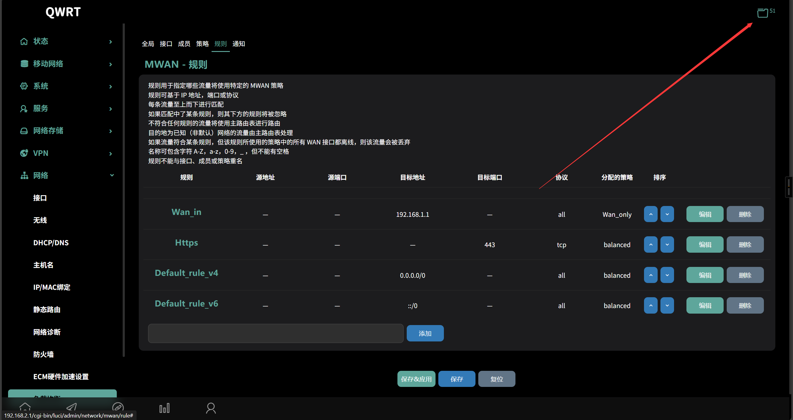

如果你希望在访问某些IP时，或者指定某内网IP访问时使用特定的接口，可以新建一个策略，并指定该策略使用某特定接口的成员，然后移步下一步

### 配置规则

本步骤不是所有都需要人都需要配置，按需选择

进入接口-负载均衡-规则

输入一个规则名称，然后点击添加

源地址：指定某一特定内网 ip 使用此规则

源端口：指定某一特定内网端口使用此规则

目标地址：访问某一特定地址时使用此规则

目标端口：访问某一特定端口时使用此规则

协议：使用某一协议时，使用此规则

粘滞模式：来自相同源 IP 的流量，如果已经匹配过此规则并且在粘滞超时时间内，将会使用相同的 WAN 接口（此模式会提高连接的稳定性，但是对于已匹配该规则的IP来说，只会使用固定的WAN口，直到超时）

粘滞超时：粘滞模式超时时间，超时后会重新匹配规则

IPset： 匹配 IPset 规则列表名称。需要先配置 /etc/dnsmasq.conf 中的 IPset 规则（例如：“ipset=/youtube.com/youtube”）

分配的策略：指定符合该规则的流量使用的策略

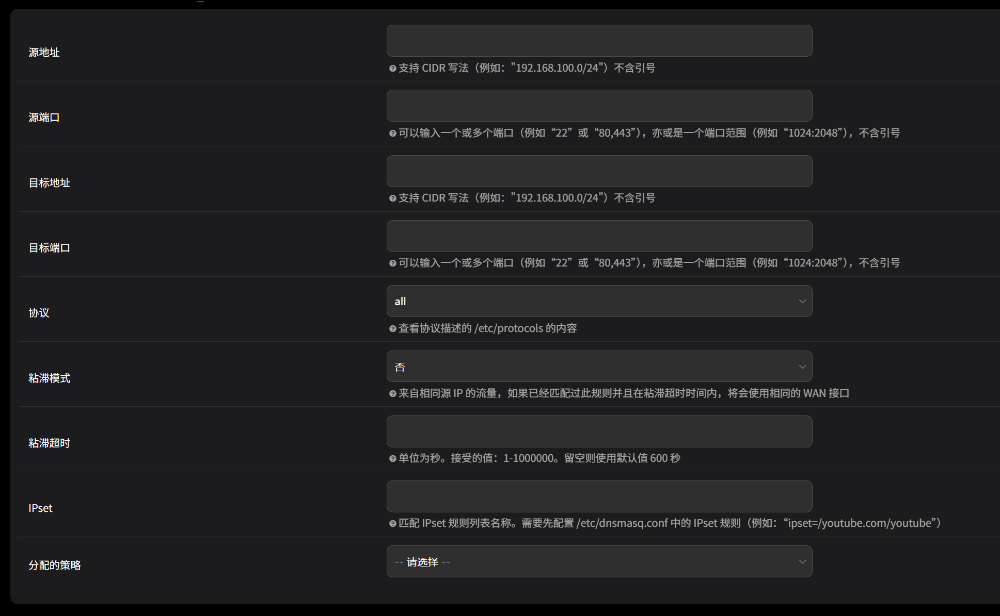

配置完毕后点击保存，然后回到规则页面

右侧可以改变规则顺序，越高的规则会优先进行匹配，所有规则只有在Default-rule_v4/6上方才会生效

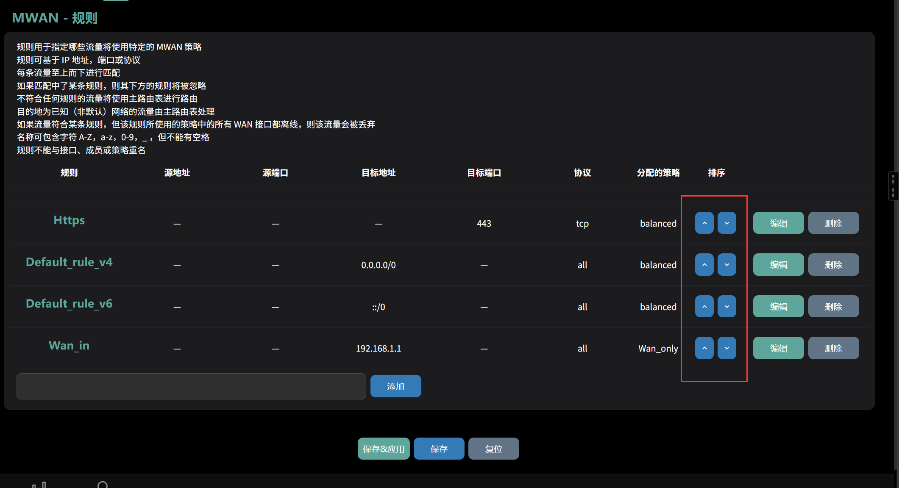

配置完毕后点击保存

如果刚刚你的所有配置均只点了保存，在最后需要点击右上方的图标然后点击保存&应用

然后就完成了所有配置

注意：该插件疑似与Openxxxsh，PaXXXall，SXX Plus+等插件冲突，使用该插件尽量不要使用这类插件

## SSH 连接路由器

!>进入路由器终端进行错误操作可能对路由器系统产生影响，请谨慎操作！

当你的TTYD终端出现了莫名奇妙的问题时，可以使用这个方法

SSH 连接地址：你的路由器后台 IP（不要带http://，格式如：xx.xx.xx.xx）

SSH 连接账号：root

SSH 连接密码：你的路由器后台密码

如果你没有诸如 XShell 之类的 ssh 连接软件可以使用 Windows 自带的 PowerShell 连接

打开PowerShell，输入`SSH 连接账号@SSH 连接地址`

然后输入`yes`回车

然后输入 SSH 连接密码回车（输入密码时不会显示你输入的内容，正常输入即可）

## 通过 SSH 重置路由器

通过 SSH 连接并登录路由器

输入`firstboot`然后输入`y`确认

最后输入`reboot`重启路由器