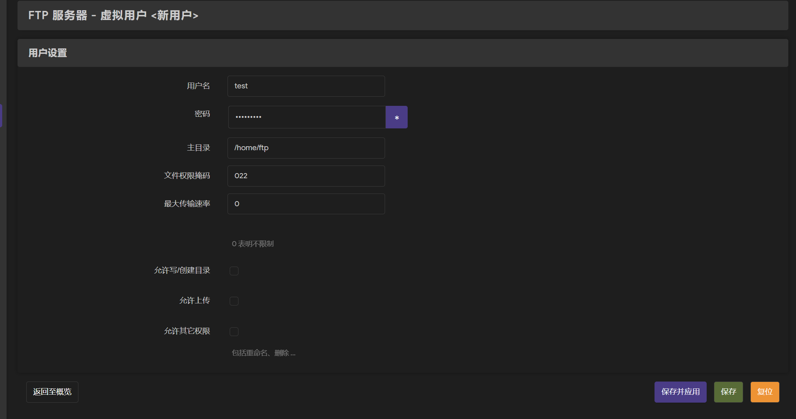

# R3G 进阶教程

!>进阶教程部分内容可能会出现不可意料的后果，请谨慎操作！

## 开启WAN口访问后台

登录后台-网络-防火墙-通信规则-添加

根据下图设置（协议可根据需求更改），并保存然后再点击保存并应用

***注意：WAN口访问后台即使放开了防火墙，可能有些功能也无法使用，比如后台的终端和SSH，分别需要在系统-终端-配置 以及系统-管理权-SSH访问 中将监听接口改为未指定***

## 硬盘挂载

R3G 仅支持 USB 连接，所以需要一个硬盘盒，并接入USB口

### 自动挂载：

4月8日以后的R3G固件均会自动挂载硬盘，如未挂载，登录后台-系统-挂载点 点击挂载已连接设备

然后就会在已挂载的设备中看到你的硬盘

### 手动挂载：

登录后台-系统-挂载点 点击添加

设置完毕后点击保存 然后保存并应用

## Samba 网络共享

与硬盘挂载类似，网络共享默认会自动开启，默认为可匿名访问，可以直接在Windows等系统直接挂载。如果未自动开启可尝试以下步骤。

登录后台-网络存储-网络共享-共享目录

名称可随意设置，路径中的`/mnt/sda1`为磁盘挂载的路径 

其他设置按需设置，其中如果关闭匿名访问，则需要使用后台账号密码登录，且允许用户中填写root（不建议关闭匿名访问，似乎有点奇奇怪怪的问题导致无法登录）

### Windows 下 samba 挂载

打开文件资源管理器（此电脑），在网络位置处右键，点击添加一个网络位置

点击两次下一步，填入`\\网关地址\共享目录名称` 例如`\\192.168.7.1\sda1`

接着无脑下一步即可，如果配置正确会跳转到你挂载的目录

如果关闭了匿名访问，这里会要求输入账号密码。如下图，输入账号密码后即可访问

## 开启 FTP 服务

也与上述相同，FTP服务为默认开启

登录账号密码为后台账号密码，IP 地址为网关地址，端口为 21

如果不想使用 root 登录，可在后台-网络存储-FTP服务器-虚拟用户中开启并添加一个虚拟用户（不建议使用虚拟用户，似乎也有奇怪的问题）

## 连接 SSH

!>进入路由器终端进行错误操作可能对路由器系统产生影响，请谨慎操作！

后台-系统-终端可以满足基本的需求，但是如果硬要使用SSH请执行下面操作

R3G 固件不同预装的软件包也可能不同，所以先要进入系统-软件包中检查是否有安装 openssh-server，如果未安装，先更新列表然后，在可用界面搜索 openssh-server 并安装（如果已经安装了就不会出现在这个页面，而会出现在已安装页面）

如果需要文件传输可以安装 openssh-sftp-server

安装完毕后，使用ssh客户端（或者Win的PowerShell）使用后台登录的账号密码即可连接SSH

PowerShell连接命令`ssh 账号@路由器后台ip`（ ip 不要带`http://`）然后输入`yes`接着输入密码即可连接

## 通过 SSH 重置路由器

通过 SSH 连接并登录路由器

输入`firstboot`然后输入`y`确认

最后输入`reboot`重启路由器

