# 常见问题

## 前言

常见问题的相关处理方式不再区分路由器型号或者系统类别，演示系统将会使用我撰写时最顺手的系统，操作的基本逻辑是一致的

## 部分网站无法访问

下述排查流程也适用于其他莫名其妙的的网络问题

### 1.排查网关冲突问题

进入后台-网络-接口

查看 WAN 和 LAN 的 IPV4 地址

如果 WAN 为`192.168.a.c `LAN 为 `192.168.a.d`(如WAN为192.168.1.3 Lan为192.168.1.1)则证明是网关冲突,你需要按照

[Immortalwrt 入门教程-修改后台登录地址](/IntroductionTutorial/Immortalwrt?id=修改后台登录地址) 或 [QWRT 入门教程-修改后台登录地址](/IntroductionTutorial/QWRT?id=修改后台登录地址)修改路由网关（即修改后台登录地址）

### 2.排查 DNS 问题

进入后台-网络-网络诊断

在 Nslookup 左侧的框中填写一个域名如 `www.baidu.com` 然后点击 Nslookup 按钮 

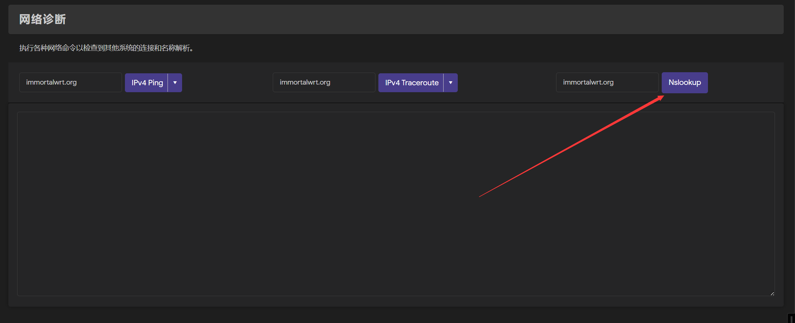

正常情况下你会获得类似下图的输出（Address后面的内容不一样很正常,如果没有Address而是其他错误就不正常）

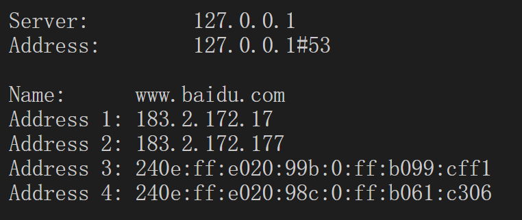

如果你没有得到类似上图的输出，基本可以确定为 DNS 异常。

你需要按照[Immortalwrt 入门教程-修改路由 DNS](/IntroductionTutorial/Immortalwrt?id=修改路由器-dns) 或 [QWRT 入门教程-修改路由器 DNS](/IntroductionTutorial/QWRT?id=修改路由器-dns)来解决

常用公共 DNS

|                       | DNS 1           | DNS 2           |
| --------------------- | --------------- | --------------- |
| **114 DNS**           | 114.114.114.114 | 114.114.115.115 |
| **阿里云 DNS**        | 223.5.5.5       | 223.6.6.6       |
| **百度DNS**           | 180.76.76.76    | 无              |
| **Google DNS**        | 8.8.8.8         | 8.8.4.4         |
| **腾讯 DNS (DNSPod)** | 119.29.29.29    | 119.28.28.28    |

### 3.排查上游网络问题

如果以上步骤都无法解决，请尝试排查上游的网络问题

## 无法进入UBOOT

打开电脑的控制面板，点击`网络和 Internet `然后点击`网络和共享中心`（如果你的控制面板查看方式不是类别，你将可以直接看到网络与共享中心）

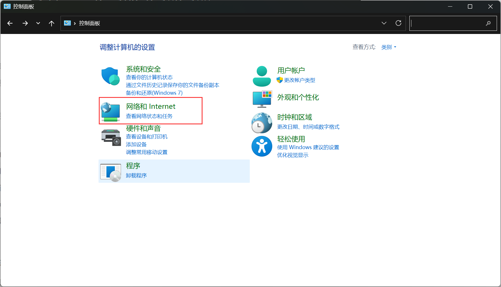

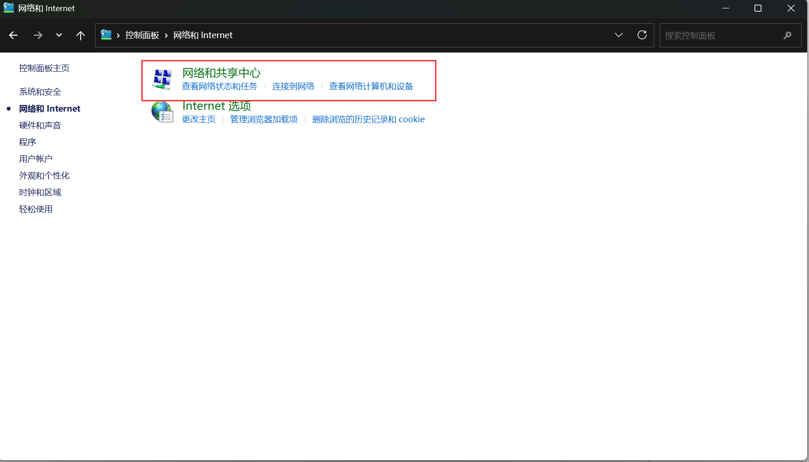

然后点击`更改适配器设置`

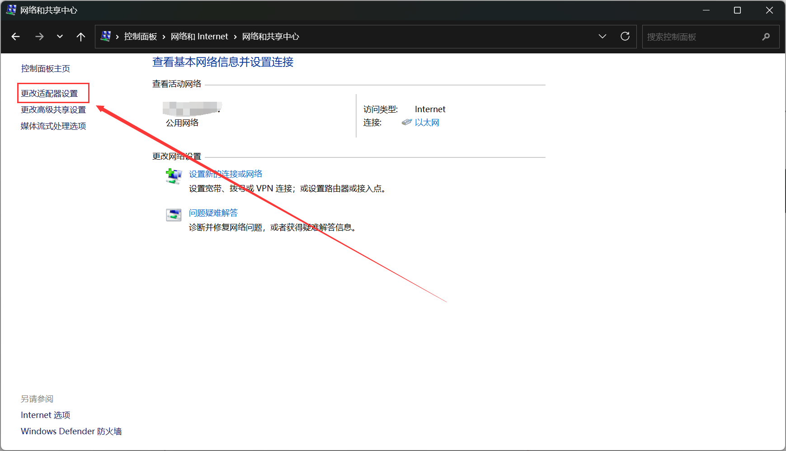

然后右键你的网口所对应的网络连接（如我的是以太网），点击属性

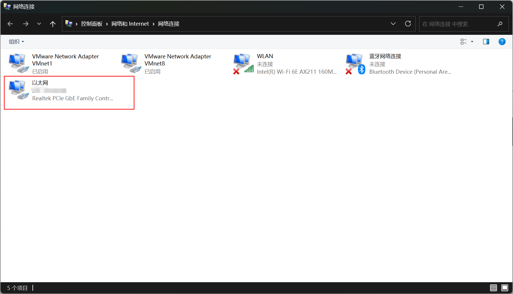

然后双击 `Internet 协议版本4（TCP/IPV4）`然后按图片填写（DNS和默认网关可以不填写）然后点击`确定`保存

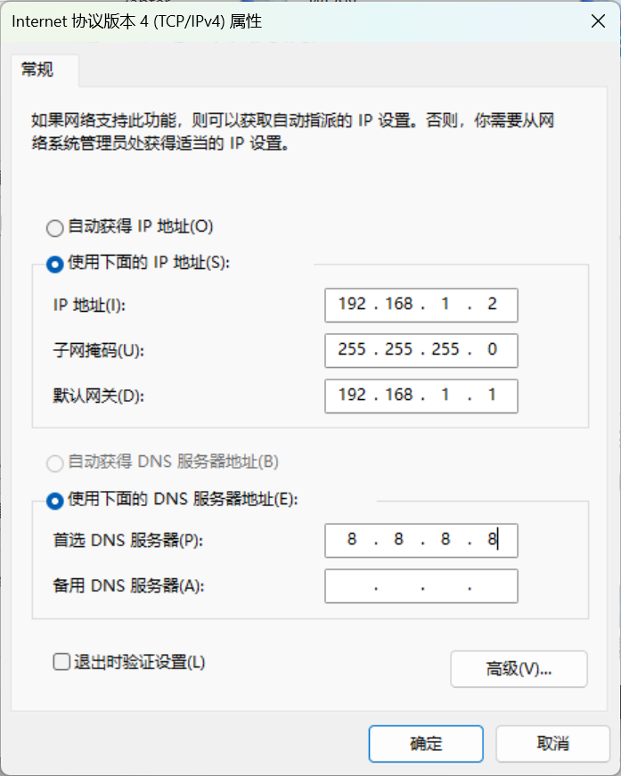

如果此时可以正常进入 `Uboot` 后面就不用看了，如果不行，点击 `配置` 然后点击 `高级`

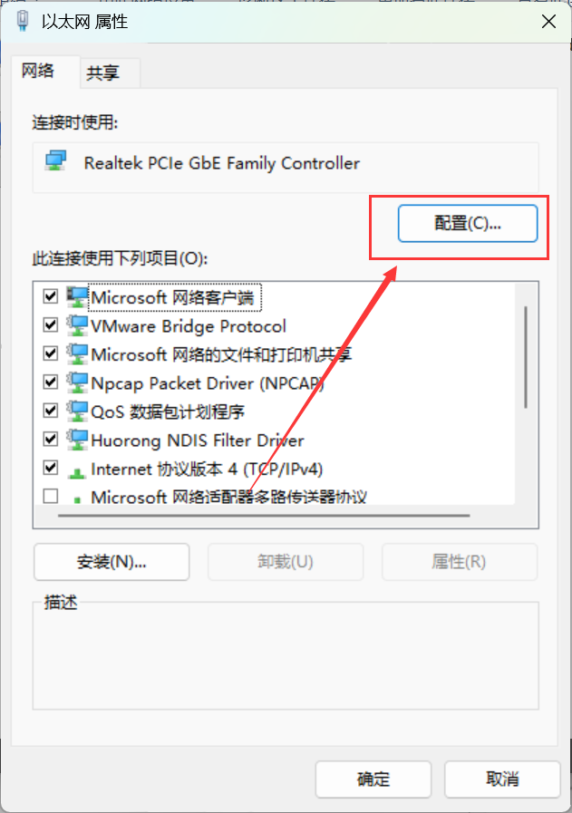

找到`连接速率与双工模式`将该值修改为`10 Mbps 全双工`（100 Mbps 应该也可以）

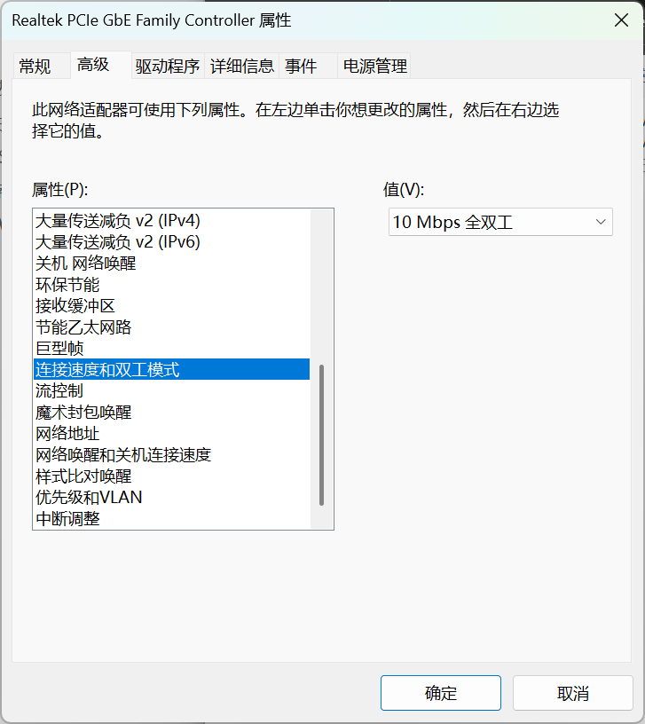

然后点击确定，然后重新尝试进入 `Uboot`

刷完机后，记得将以上设置全部还原

## WIFI 无法连接

### 1.删除设备上的已连接WIFI

在不同品牌手机上和电脑上该操作不同，可能寻找删除网络，或者忘记网络之类的选项，然后重新连接。

该方法适用于 WIFI 配置发生变化后，无法连接的状况

### 2.检测路由器 WIFI状态

正常情况下网络-无线界面应该类似下图所示，期中在无设备连接时dBm无显示（如R3G-2.4G）有设备连接时会显示dBm值（如R3G-5G），如果出现其他情况，如5GHz完全不显示，可能是设备硬件出现异常。

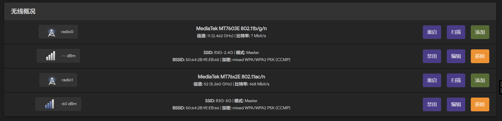

### 3.检查路由器 WIFI 信道

进入路由器后台-网络-无线

编辑有问题的频段的 WIFI 修改 WIFI 信道

中国支持的 WIFI 信道列表：（具体信道选择需要依据网络环境中其他 WiFi 的信道）

注意：非列表信道理论上也可以使用，但是大部分国产手机/设备厂商不会对该类信道进行适配，有很大概率会出现无法连接的情况

*非重叠：该信道信号不与其他信道重叠，可以优先使用      DFS：该信道频段与雷达信号频段重叠，需要动态避让，效果较差*

| 2.4 GHz      | 5 GHz         |
| ------------ | ------------- |
| 1（非重叠）  | 36（非重叠）  |
| 2            | 40（非重叠）  |
| 3            | 44（非重叠）  |
| 4            | 48（非重叠）  |
| 5            | 52（DFS）     |
| 6（非重叠）  | 56（DFS）     |
| 7            | 60（DFS）     |
| 8            | 64（DFS）     |
| 9            | 149（非重叠） |
| 10           | 153（非重叠） |
| 11（非重叠） | 157（非重叠） |
| 12           | 161（非重叠） |
| 13           | 165（非重叠） |

也可以将国家代码改为 `CN` 然后信道选择自动（如下图）

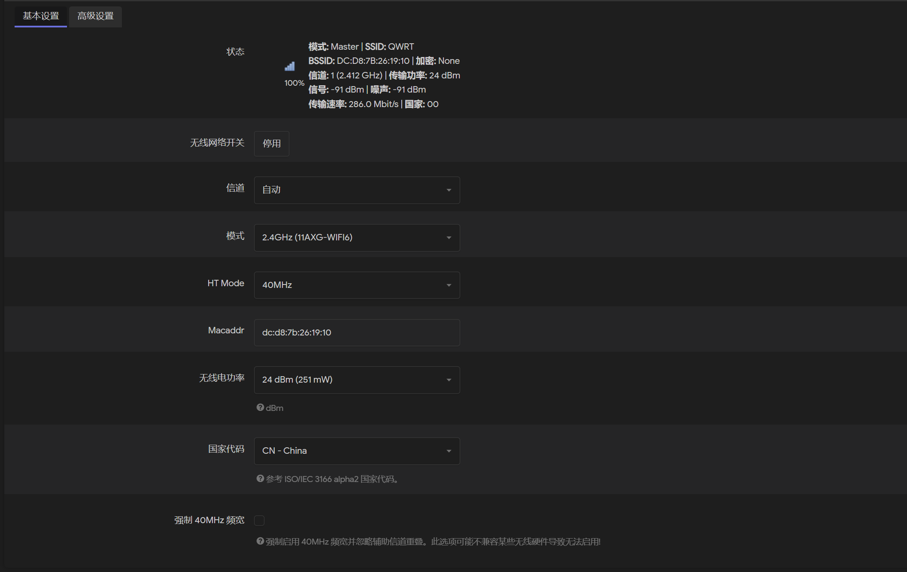

完成信道设置后，重启路由器

## 修改后台登录IP/LAN IP 后 TTYD 终端无法正常使用

使用 ssh 连接路由器

输入`vi /etc/init.d/ttyd`,按 `i` 进入插入模式

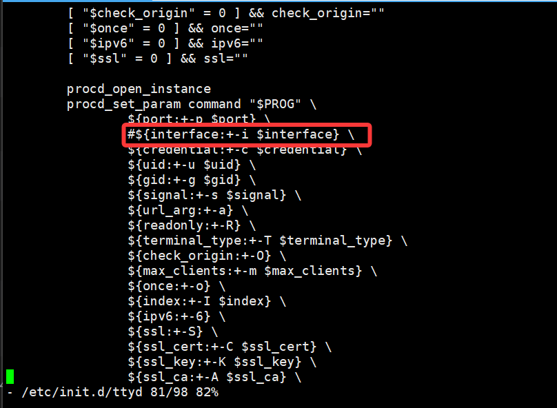

在图示位置前方插`#`号，按 `ESC`,然后输入`:wq`保存

然后输入`service ttyd restart`重启 TTYD 服务

## Windows 无法访问网络共享

如果遇到访问共享文件时提示：“你不能访问此共享文件夹，因为你组织的安全策略阻止未经身份验证的来宾访问”，可能需要启用不安全的访客登录

以下有两种方法，任选其一即可

### 1.使用注册表编辑器修改

!>错误操作注册表可能会引发系统崩溃，请谨慎操作

打开注册表编辑器

进入 `HKEY_LOCAL_MACHINE\SOFTWARE\Policies\Microsoft\Windows\LanmanWorkstation` 如果 `LanmanWorkstation` 不存在，右键

`Microsoft`选择新增-项并命名为`LanmanWorkstation`

然后右键 `LanmanWorkstation` 选择 新增-DWORD(32位)值 ，命名为 `AllowInsecureGuestAuth`

在右侧窗格中，右键点击`AllowInsecureGuestAuth`，点击修改，将数值数据设为`1`然后确定

### 2使用本地策略组编辑器：

按下 `WIN `+ `R `输入 `gpedit.msc` 然后点击确定

进入`计算机设置`-`系统模板`-`网络`-`Lanman工作站`

在右侧窗格中，右键`启用不安全的来宾登录`，点击编辑

选择已启用，然后确定

