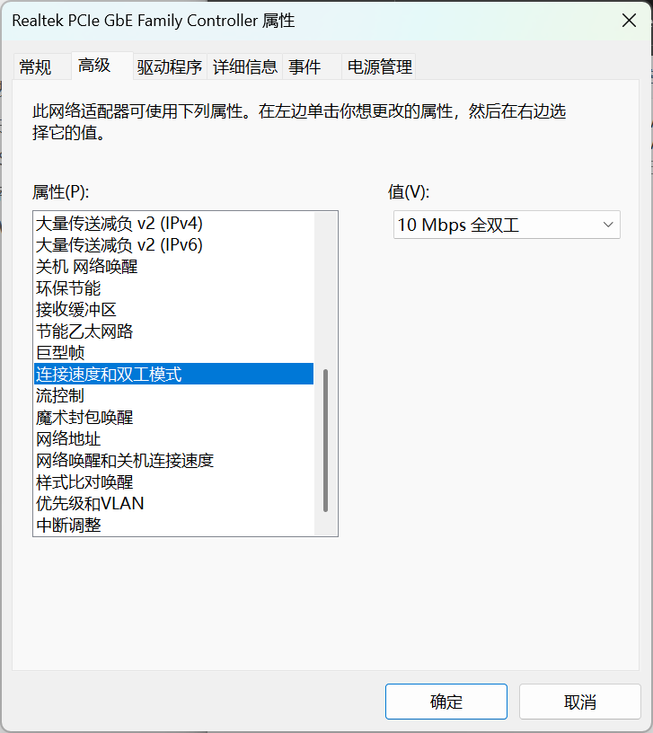

# 常见问题

## 前言

常见问题的相关处理方式不再区分路由器型号或者系统类别，演示系统将会使用我撰写时最顺手的系统，操作的基本逻辑是一致的

## 部分网站无法访问

下述排查流程也适用于其他莫名其妙的的网络问题

### 1.排查网关冲突问题

进入后台-网络-接口

查看 WAN 和 LAN 的 IPV4 地址

如果 WAN 为`192.168.a.c `LAN 为 `192.168.a.d`(如WAN为192.168.1.3 Lan为192.168.1.1)则证明是网关冲突,你需要按照

[R3G 入门教程-修改后台登录地址](/IntroductionTutorial/R3G?id=修改后台登录地址) 或 [亚瑟AX1800Pro & 兆能M2 入门教程-修改后台登录地址](/IntroductionTutorial/JDC-01&ZN-M2?id=修改后台登录地址)修改路由网关（即修改后台登录地址）

### 2.排查 DNS 问题

进入后台-网络-网络诊断

在 Nslookup 左侧的框中填写一个域名如 `www.baidu.com` 然后点击 Nslookup 按钮 

正常情况下你会获得类似下图的输出（Address后面的内容不一样很正常,如果没有Address而是其他错误就不正常）

如果你没有得到类似上图的输出，基本可以确定为 DNS 异常。

你需要按照[R3G 入门教程-修改路由 DNS](/IntroductionTutorial/R3G?id=修改路由器-dns) 或 [亚瑟AX1800Pro & 兆能M2 入门教程-修改路由器 DNS](/IntroductionTutorial/JDC-01&ZN-M2?id=修改路由器-dns)来解决

常用公共 DNS

|                       | DNS 1           | DNS 2           |
| --------------------- | --------------- | --------------- |
| **114 DNS**           | 114.114.114.114 | 114.114.115.115 |
| **阿里云 DNS**        | 223.5.5.5       | 223.6.6.6       |
| **百度DNS**           | 180.76.76.76    | 无              |
| **Google DNS**        | 8.8.8.8         | 8.8.4.4         |
| **腾讯 DNS (DNSPod)** | 119.29.29.29    | 119.28.28.28    |

### 3.排查上游网络问题

如果以上步骤都无法解决，请尝试排查上游的网络问题

## 亚瑟＆兆能 M2 无法进入UBOOT

打开电脑的控制面板，点击`网络和 Internet `然后点击`网络和共享中心`（如果你的控制面板查看方式不是类别，你将可以直接看到网络与共享中心）

然后点击`更改适配器设置`

然后右键你的网口所对应的网络连接（如我的是以太网），点击属性

然后双击 `Internet 协议版本4（TCP/IPV4）`然后按图片填写（DNS和默认网关可以不填写）然后点击`确定`保存

如果此时可以正常进入 Uboot 后面就不用看了，如果不行，点击 `配置` 然后点击 `高级`

找到`连接速率与双工模式`将该值修改为`10 Mbps 全双工`（100 Mbps 应该也可以）

然后点击确定，然后重新尝试进入 Uboot

刷完机后，记得将以上设置全部还原
