# Immortalwrt 入门教程

## 前言

当教程中某一部分只适用于某个特定型号的路由器时将会出现以下标记

`[R3G]` 小米 R3G 路由器

## 后台密码及WIFI密码

R3G群内目前有两种固件，分别为Lede和Immortalwrt，默认预装Immortalwrt

Lede 版本 默认后台192.168.1.1

Immortalwrt 版本 默认后台192.168.7.1

账号：root

密码：88888888

WIFI密码：88888888

## 修改后台密码

登录后台-系统-管理权

输入新密码后保存即可

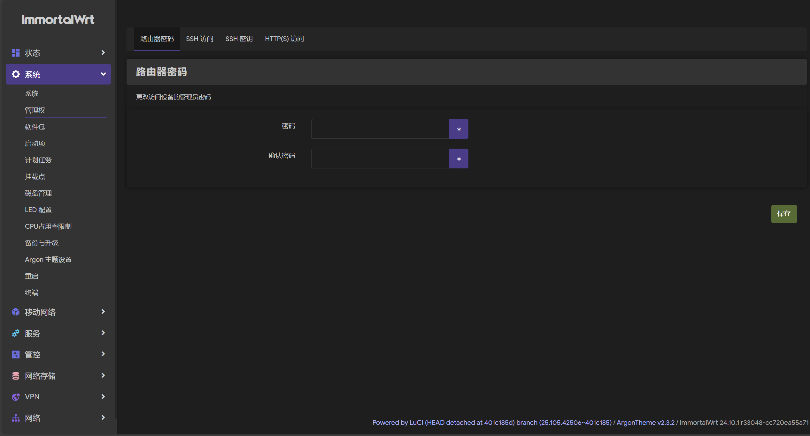

## 修改WIFI密码

登录后台-网络-无线

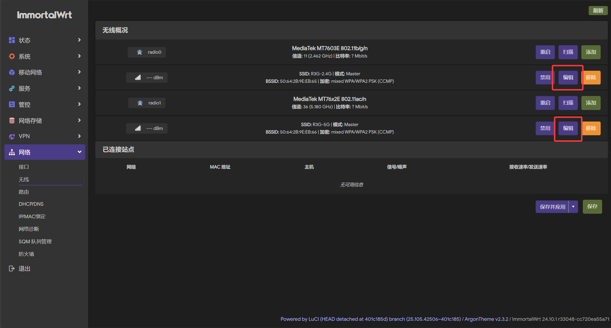

编辑-无线安全

加密模式选择WPA2-PSK 如需兼容老设备可以选择WPA-PSK/WPA2-PSK Mixed Mode

下方密钥处填写新密码，然后点击保存

保存后右上角会显示未保存的配置，点击并选择保存并应用才会生效（后台中很多操作都需要进行确认，点击恢复会还原设置前的配置）

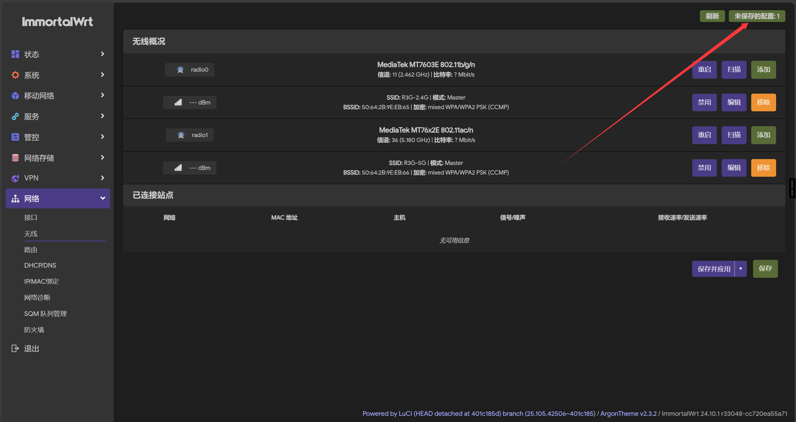

## 修改WIFI名称

进入后台-网络-无线

编辑 2.4GHz 和 5Ghz 的 WiFi ，ESSID即为WIFI名称

修改后保存并应用即可

## WIFI开启双频合一

进入后台-网络-无线

编辑 2.4GHz 和 5Ghz 的 WiFi ,将 ESSID 改为相同的名字，密码也改为相同的密码即可

## 修改后台登录地址

登录后台-网络-接口

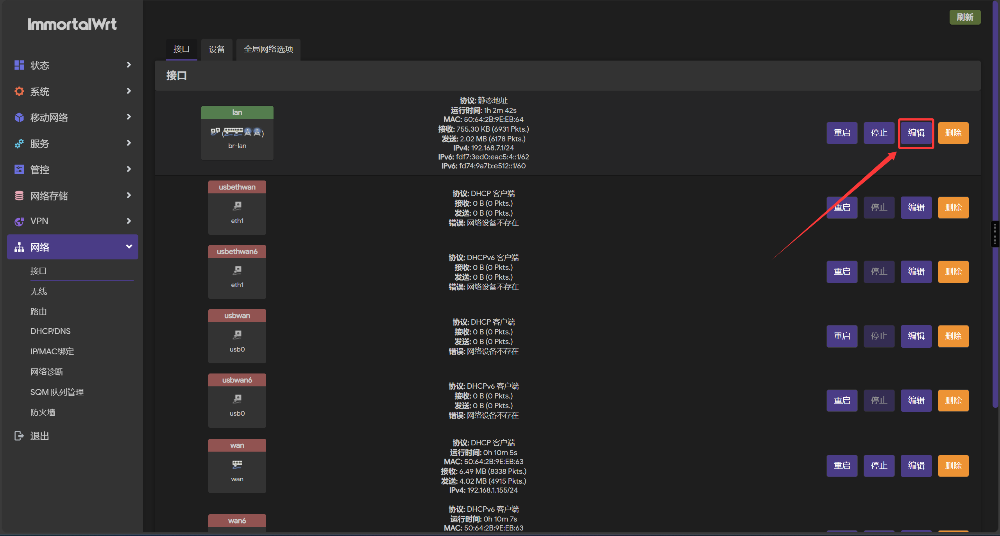

修改此处ip地址即可（建议设置格式：192.168.x.1）

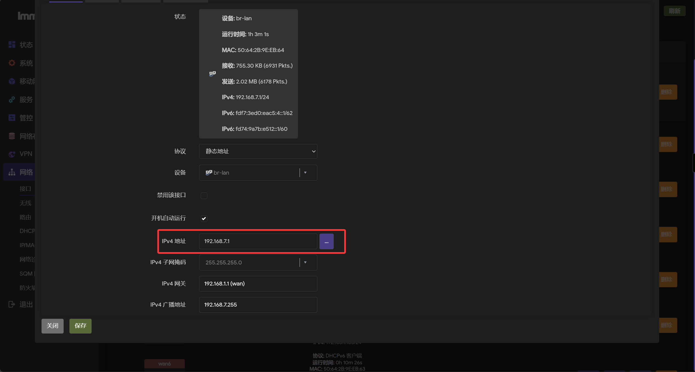

保存后，点击右上角未保存的配置，此处需要点击强制保存，否则会自动恢复

## 为某个设备设置静态IP地址

登录后台-网络-DHCP/DNS-静态地址分配-添加

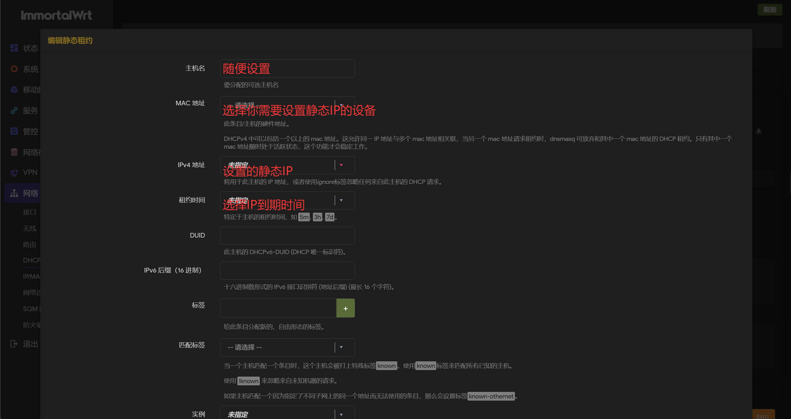

最后保存，点击右上角未保存的配置，保存并应用

## 连接随身WIFI

将随身 WIFI 插入 USB 口

登录后台-网络-接口

看到 usbethwan 或 usbwan 获取到 ip 地址证明连上了

如果没有获取到，考虑连接线是否正常。如果还是不行多重启几次路由器和接口。如果还还还是不行，可能是供电不够，想办法改供电吧（这里不教，酷安有教程，改坏了自己负责）

## 连接4G/5G模块

R3G仅支持USB模式

将模块插入USB

登录后台-移动管理-模块管理

一般情况下首次插入模块需要在移动管理-模块管理-QModem 设置中手动扫描USB（勾选启用USB模组扫描后会在路由器开机的时候自动扫描）

然后回到模组信息页面，出现了基本信息(如下图)，就是连接上了

后续就自行摸索吧（我没有卡）

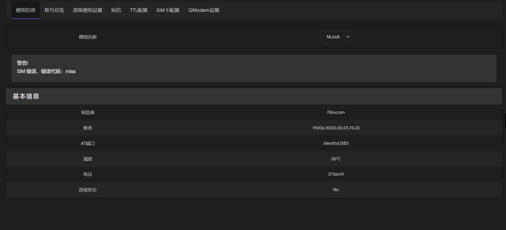

模块支持列表（仅供参考，以实际为准）：

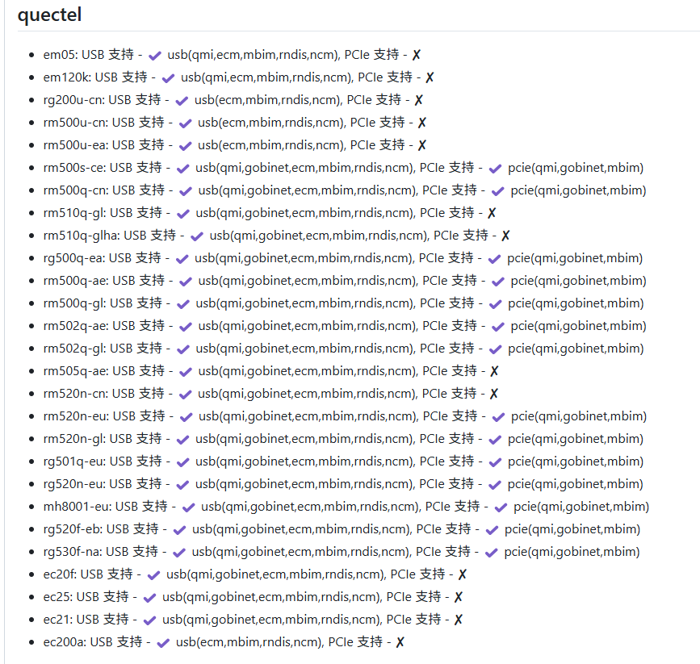

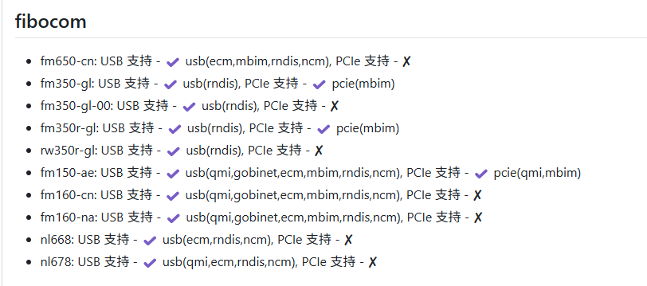

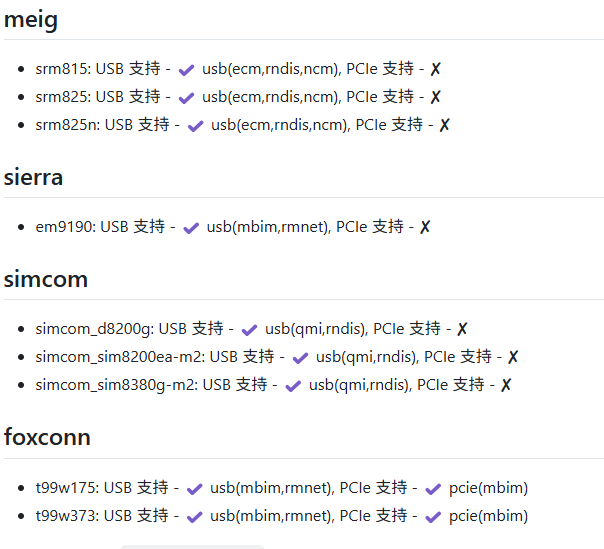

## 更新固件

!>**更新固件期间请勿断电**

先在群内下载好所需的固件（需使用文件名中带R3G的固件）

解压后，可以看到文件名末尾分别为 sysupgrade roofs0 kernel kernel1的4个文件

这里我们只需要sysupgrade这个文件

登录后台-系统-备份与升级-刷写与升级，上传sysupgrade这个文件后，点击继续，等待重启（保留配置选项正常升级可以勾选，但是如果需要降级可能需要取消勾选该选项）

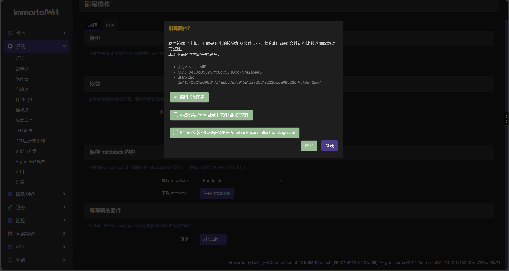

## 通过breed进行刷机

breed刷机会清除所有配置，建议在上述更新方法无效时使用，同时如果使用上述方法刷机时意外断电，也可以使用本方法。

!>**breed刷机操作失误变砖的概率更大，请严格按照以下步骤执行**

!>**更新固件期间请勿断电**

将路由器断电，长按重置键（此按键仅可用于进入breed，重置功能已经失效了）并插上电源，等待5-10s。用网线将路由器Lan口与电脑连接，在浏览器中输入192.168.1.1进入后台。（如果无法进入请尝试手动设置网卡ip地址为192.168.1.x（2-255） 子网掩码为255.255.255.0 网关为192.168.1.1 DNS随意填写一个可用的DNS）

然后根据群文件中*R3G刷机教程.mp4*的步骤进行刷机

[R3G刷机教程](./Image/1-1.mp4 ':include :type=iframe width=640% height=400px')

## 使用PxxsWxxl OpenCxxxh等插件

相关内容此处不教，建议询问群友

## 设置WAN口上网方式

登录后台-网络-接口

下拉协议选项可以看到以下协议

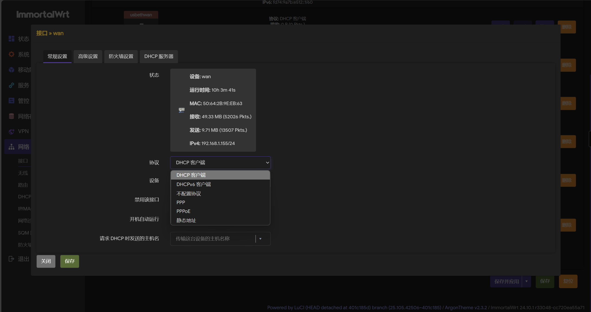

DHCP客户端：通过DHCP协议自动获取ipv4，上游网关，dns等信息，并连接互联网

DHCPv6客户端：通过DHCP协议自动获取ipv6，上游网关，dns等信息，并连接互联网（请不要在此处选择，ipv6相关配置请在WAN6接口设置）

不配置协议：一般用不到

PPP和PPPoE协议不做介绍，需要使用的自行探索（实际上是我没用过）

静态地址：可以手动指定内网ip地址 子网掩码 网关等信息

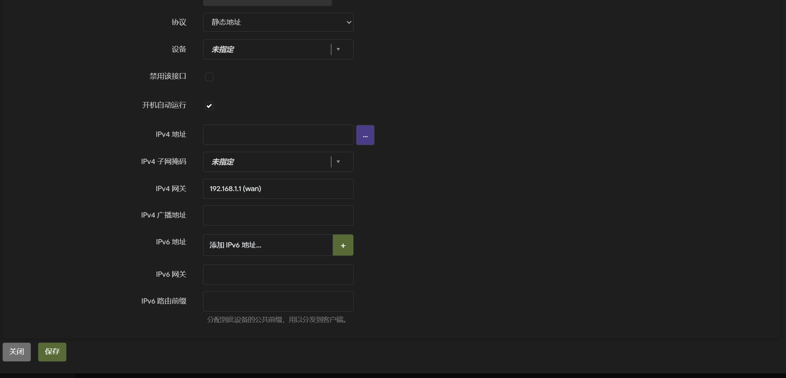

按需设置后，保存并应用即可

## 修改路由器 DNS

路由器的 DNS 可分为上游DNS（即 WAN 口 DNS ）修改它会使得路由器和路由器下游设备均使用该DNS 和 下游 DNS（即 LAN 口 DNS）修改它会使得下游设备使用该 DNS 而路由器本身使用原DNS（一般为上游（如光猫）提供的 DNS）

### 1.修改 LAN 口 DNS

进入后台-网络-接口

编辑 LAN 口，点击高级设置

在下图处填写你想要的 DNS 地址

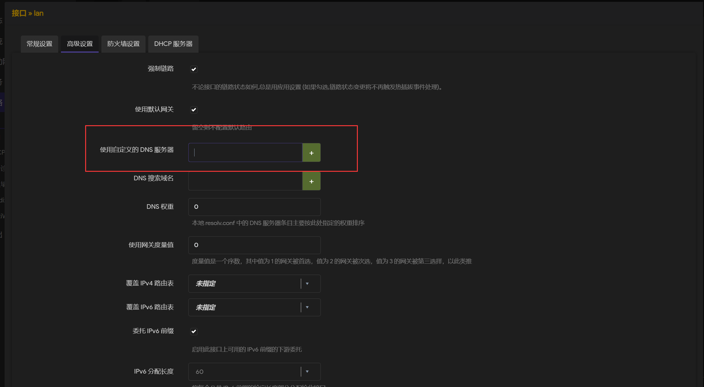

然后点击保存，再点击右上角的未保存的配置

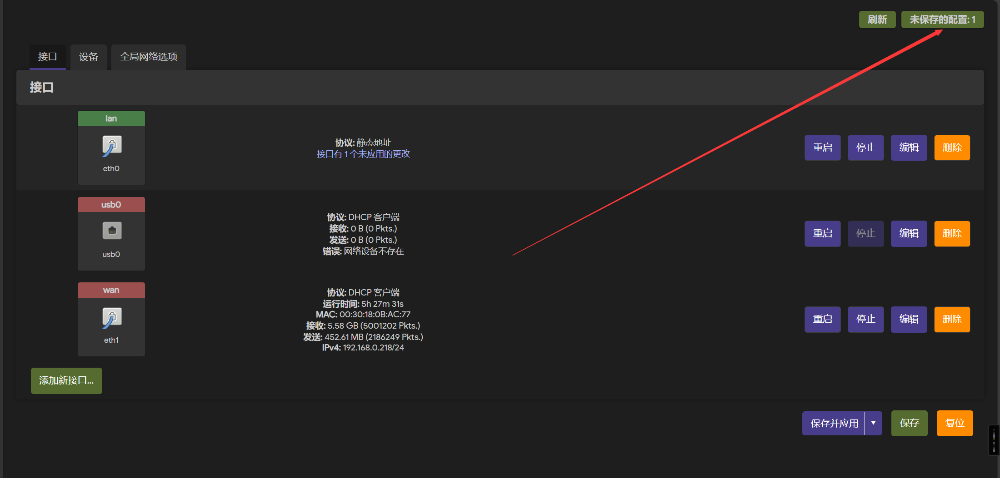

然后点击保存并应用即可

### 2.修改 WAN 口 DNS

进入后台-网络-接口

编辑 WAN 口，点击高级设置

取消勾选自动获取 DNS 服务器

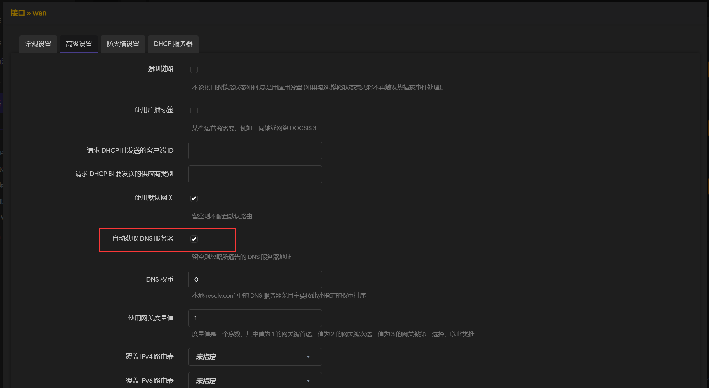

然后在下图框中填写你想要的 DNS 地址

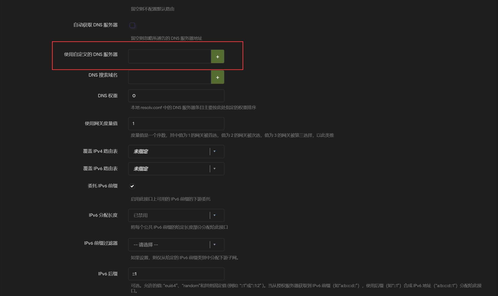

最后点击保存，再点击右上角的未保存的配置

然后点击保存并应用即可