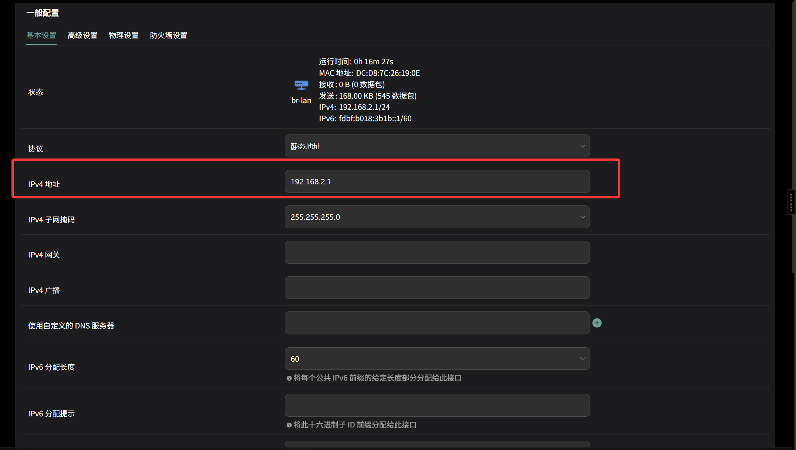
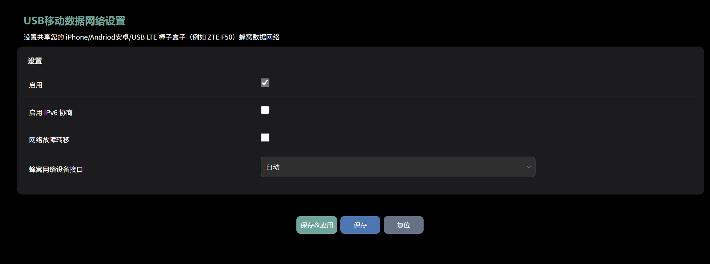

# 亚瑟 AX1800Pro & 兆能M2 入门教程

## 兆能 M2 接口介绍

|    电源接口     |   开关   | 网口 | 网口 | 网口 | 网口 |   USB接口    |  按钮  |  按钮  |
| :-------------: | :------: | :--: | :--: | :--: | :--: | :----------: | :----: | :----: |
| 12V 5535 DC接口 | 电源开关 | LAN  | LAN  | LAN  | WAN  | USB 3.0 接口 | 重置键 | 无定义 |

## 后台密码及WIFI密码

QWRT固件默认地址：192.168.1.1

账号：root

密码：password

WIFI 默认无密码

## 修改后台密码

登录后台-系统-管理权

然后拉到最下面点击保存&应用即可

## 修改 WIFI 密码

登录后台-网络-无线

Wifi0为5GHz Wifi1为2.4GHz

点击编辑-接口配置-无线安全

加密模式选择WPA2-PSK 如需兼容老设备可以选择WPA-PSK/WPA2-PSK Mixed Mode

修改密码点击保存&应用后生效

## 修改 WIFI 名称

进入后台-网络-无线

编辑 2.4GHz 和 5Ghz 的 WiFi ，ESSID即为WIFI名称

修改后保存并应用即可

## WIFI 开启双频合一

进入后台-网络-无线

编辑 2.4GHz 和 5Ghz 的 WiFi ,将 ESSID 改为相同的名字，密码也改为相同的密码即可

## 修改后台登录地址

登录后台-网络-接口

编辑LAN口

修改ipv4地址为你想要的后台地址（建议格式：192.168.x.1）

然后保存&应用即可

## 为某个设备设置静态IP

登录后台-网络-DHCP/DNS-静态地址分配-新增

主机名随意填写

mac地址选择/填写需要设置静态ip设备的mac地址

ipv4地址为需要设置的静态ip

租期格式：`xh/xd/infinite`(例如：1h/1d)

## 连接4G/5G模块

亚瑟仅支持USB模式

将模块插入USB

登录后台-移动网络-QWRT模组管理

插入模块后，需要再QModem设置中手动扫描USB（勾选图中的启用USB模组扫描后会在路由器开机的时候自动扫描）

扫描到模组后，会出现如下信息，并且会在网络-接口中自动创建一个1_1的接口

后续就自行摸索吧（我没有卡）

## 更新固件

!>**更新固件期间请勿断电**

先在群内`京东云亚瑟-QWRT固件`或`兆能M2-QWRT`中下载好所需的固件（文件名末尾为sysupgrade的文件）并解压

进入后台-系统-备份/升级

在镜像选择刚刚解压好的固件，点击刷写固件，然后执行即可

## 通过UBOOT刷机

Uboot刷机会清除所有配置，建议在上述更新方法无效时使用，同时如果使用上述方法刷机时意外断电，也可以使用本方法。

!>**uboot刷机操作失误变砖的概率更大，请严格按照以下步骤执行**

!>**更新固件期间请勿断电**

先在群内`京东云亚瑟-QWRT固件`或`兆能M2-QWRT`下载好所需的固件（文件名末尾为factory的文件）并解压

将路由器断电，长按重置键（此按键仅可用于进入uboot，重置功能已经失效了）并插上电源，等待5-10s。用网线将路由器Lan口与电脑连接，在浏览器中输入192.168.1.1进入后台。（如果无法进入请尝试手动设置网卡ip地址为192.168.1.x（x范围：2-255） 子网掩码为255.255.255.0 网关为192.168.1.1 DNS随意填写一个可用的DNS）

进入下图界面，点击选择文件，选择刚刚解压好的固件

然后点击Update firmware

等待刷机完毕即可（刷机完毕后，亚瑟指示灯会变为绿色，兆能由于指示灯特殊，建议以是否出现WIFI信号作为判断依据）

## 使用SxxSxxR Plus+ OpenCxxxh插件

!>兆能M2由于系统预占空间较大，不建议使用OC

进入后台-系统-TTYD终端

输入后台账号密码（密码输入时不会显示）

在终端中输入下列神秘代码，刷新后台会有奇迹发生，后续内容自行配置

`echo 0xDEADBEEF > /etc/config/google_fu_mode`

## 连接随身WIFI

### 使用插件连接

将随身WIFI通过USB与路由器连接

进入后台-系统-移动网络-USB移动数据网络设置

点击启用，蜂窝网络设备接口选择eth4/usb0（能看到哪个就选哪个）

点击保存&应用即可

### 手动连接

由于该插件在系统重启后，会清除该接口的所有配置，所以如果需要对接口特殊配置，请不要使用该插件，按照下方步骤添加接口

进入后台-网络-接口，点击添加新接口

新接口的名称：自行指定，不得与现有重复

新接口的协议：一般选择DHCP，如有特殊需求可选择静态地址

包含以下接口：选择usb0或者eth4（有哪个选哪个，图片仅是演示，所以都没有）

然后点击提交

然后会自动跳转，点击配置DHCP服务器（使用静态地址请跳过）

然后点击防火墙设置

选择wan，然后保存&应用

## 无线中继

无线中继操作期间，WIFI会断连，建议使用网线连接路由器进行设置

进入后台-网络-无线

点击扫描，上方wifi0对应扫描5GHz频段的wifi，下方wifi1对应扫描2.4GHz频段wifi

无线中继只能中继一个频段，两个频段都中继无效（似乎可以通过MWAN来实现中继两个频段（待验证））

选择你需要中继的WIFI点击加入网络（如果没有找到，点击下方重新扫描，如果还是扫不到，可能是信号干扰，距离过远等原因导致）

这一步默认即可，但是网络名称不要和已有的接口名重复（如你使用了随身wifi，默认接口名也是wwan与它重复），点击提交

然后在下一个界面中点击接口配置-无线安全，输入被中继WIFI的密码（开放式WIFI可忽略）

然后点击保存&应用，这样就完成了所有设置

## 安装 Argon 主题

进入后台-系统-软件包

先刷新列表然后在过滤器中搜索`luci-theme-argon`

然后你会看到一堆软件包，个人建议可以无脑选择`luci-theme-argonv3`其他版本可以自己试一试

安装完毕后，进入系统-系统-语言和界面

其中Design是默认主题，Argon_Dark和Argon_Light分别对应暗色和亮色主题，如果选择Argon会自适应选择暗色和亮色

如果想要修改Argon主题设置，进入后台-系统-软件包安装`luci-app-argon-config`和`luci-i18n-argon-config-zh-cn`后就可以在系统-Argon 主题设置中修改

## 通过 IPK 文件安装软件包

进入后台-系统-文件传输

上传IPK文件

然后点击安装即可

## 修改路由器 DNS

路由器的 DNS 可分为上游DNS（即 WAN 口 DNS ）修改它会使得路由器和路由器下游设备均使用该DNS 和 下游 DNS（即 LAN 口 DNS）修改它会使得下游设备使用该 DNS 而路由器本身使用原DNS（一般为上游（如光猫）提供的 DNS）

### 1.修改 LAN 口 DNS

进入后台-网络-接口

编辑 LAN 口

在下图处填写你想要的 DNS 地址

然后点击保存&应用即可

### 2.修改 WAN 口 DNS

进入后台-网络-接口

编辑 WAN 口，点击高级设置

取消勾选使用对端通告的 DNS 服务器，然后在下面的框中输入你想要的 DNS

然后点击保存&应用即可
