# QWRT 入门教程

## 前言

当教程中某一部分只适用于某个特定型号的路由器时将会出现以下标记

`[JDC01]` 亚瑟 AX1800Pro

`[znm2]`兆能M2

`[AP8820]`阿里云 AP8820

## 兆能 M2 接口介绍[znm2]

|    电源接口     |   开关   | 网口 | 网口 | 网口 | 网口 |   USB接口    |  按钮  |  按钮  |
| :-------------: | :------: | :--: | :--: | :--: | :--: | :----------: | :----: | :----: |
| 12V 5535 DC接口 | 电源开关 | LAN  | LAN  | LAN  | WAN  | USB 3.0 接口 | 重置键 | 无定义 |

## 后台密码及WIFI密码

QWRT固件默认地址：192.168.1.1

账号：root

密码：password

WIFI 默认无密码

## 修改后台密码

登录后台-系统-管理权

然后拉到最下面点击保存&应用即可

## 修改 WIFI 密码

登录后台-网络-无线

Wifi0为5GHz Wifi1为2.4GHz

点击编辑-接口配置-无线安全

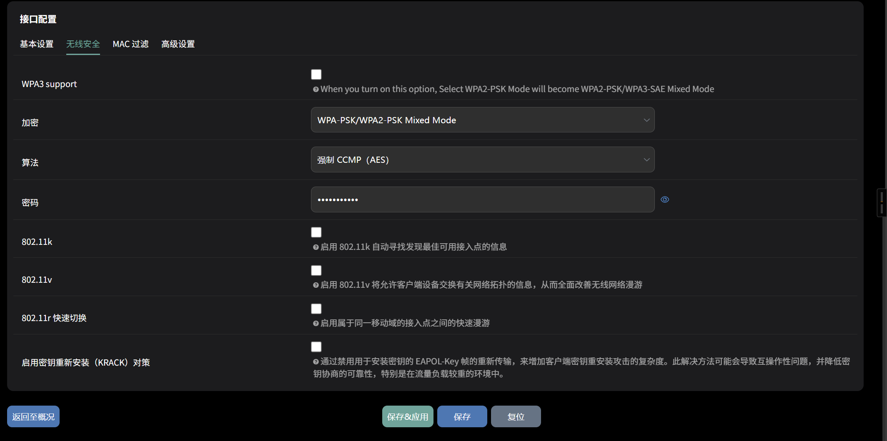

加密模式选择WPA2-PSK 如需兼容老设备可以选择WPA-PSK/WPA2-PSK Mixed Mode

修改密码点击保存&应用后生效

## 修改 WIFI 名称

进入后台-网络-无线

编辑 2.4GHz 和 5Ghz 的 WiFi ，ESSID即为WIFI名称

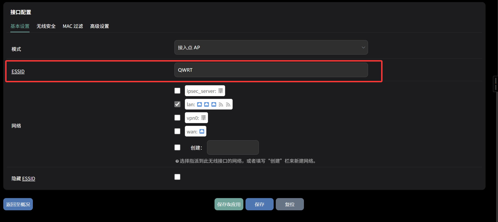

修改后保存并应用即可

## WIFI 开启双频合一

进入后台-网络-无线

编辑 2.4GHz 和 5Ghz 的 WiFi ,将 ESSID 改为相同的名字，密码也改为相同的密码即可

## 修改后台登录地址

登录后台-网络-接口

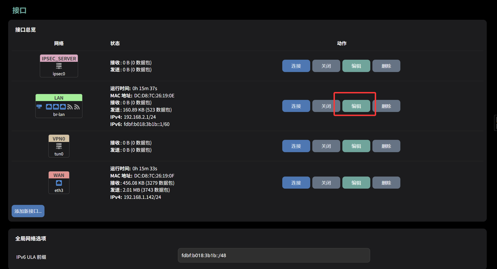

编辑LAN口

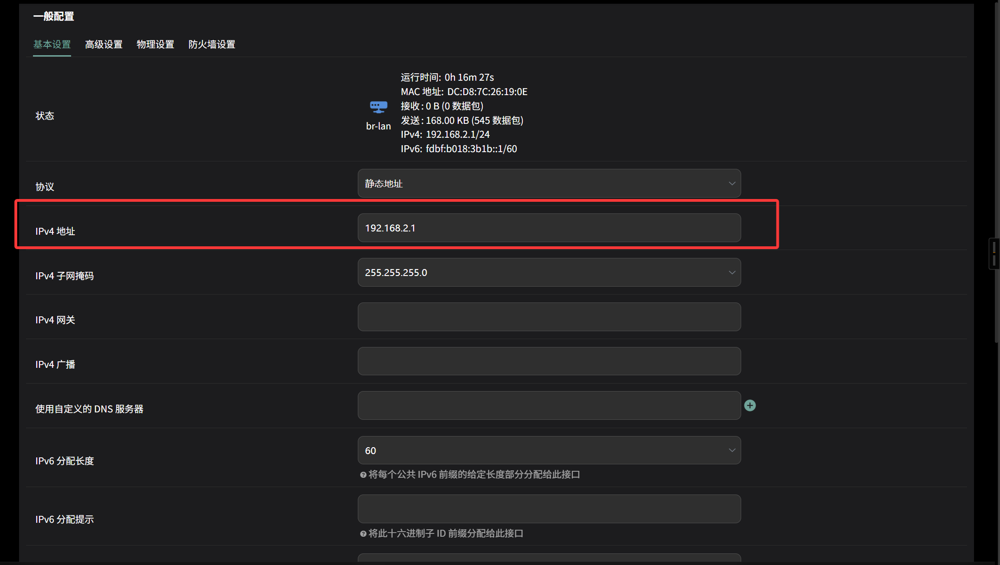

修改ipv4地址为你想要的后台地址（建议格式：192.168.x.1）

然后保存&应用即可

## 为某个设备设置静态IP

登录后台-网络-DHCP/DNS-静态地址分配-新增

主机名随意填写

mac地址选择/填写需要设置静态ip设备的mac地址

ipv4地址为需要设置的静态ip

租期格式：`xh/xd/infinite`(例如：1h/1d)

## 连接4G/5G模块

亚瑟仅支持USB模式

将模块插入USB

登录后台-移动网络-QWRT模组管理

插入模块后，需要再QModem设置中手动扫描USB（勾选图中的启用USB模组扫描后会在路由器开机的时候自动扫描）

扫描到模组后，会出现如下信息，并且会在网络-接口中自动创建一个1_1的接口

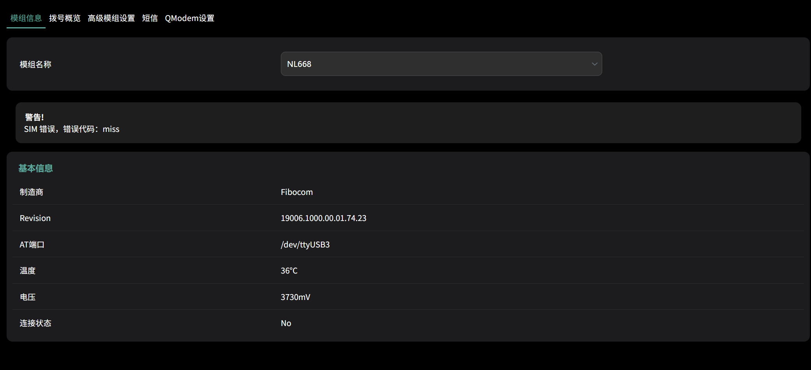

后续就自行摸索吧（我没有卡）

## 更新固件

!>**更新固件期间请勿断电**

先在群内`京东云亚瑟-QWRT固件`或`兆能M2-QWRT`中下载好所需的固件（文件名末尾为sysupgrade的文件）并解压

进入后台-系统-备份/升级

在镜像选择刚刚解压好的固件，点击刷写固件，然后执行即可

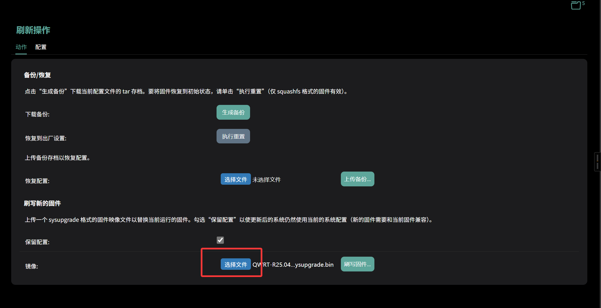

## 通过UBOOT刷机

Uboot刷机会清除所有配置，建议在上述更新方法无效时使用，同时如果使用上述方法刷机时意外断电，也可以使用本方法。

!>**uboot刷机操作失误变砖的概率更大，请严格按照以下步骤执行**

!>**更新固件期间请勿断电**

先在群内`京东云亚瑟-QWRT固件`或`兆能M2-QWRT`下载好所需的固件（文件名末尾为factory的文件）并解压

将路由器断电，长按重置键（此按键仅可用于进入uboot，重置功能已经失效了）并插上电源，等待5-10s。用网线将路由器Lan口与电脑连接，在浏览器中输入192.168.1.1进入后台。（如果无法进入可参考[常见问题 FAQ-亚瑟＆兆能-m2-无法进入uboot](/FAQ/FAQ?id=亚瑟＆兆能-m2-无法进入uboot)）

进入下图界面，点击选择文件，选择刚刚解压好的固件

然后点击Update firmware

等待刷机完毕即可（刷机完毕后，亚瑟指示灯会变为绿色，兆能由于指示灯特殊，建议以是否出现WIFI信号作为判断依据）

## 使用SxxSxxR Plus+ OpenCxxxh插件

!>兆能 M2 由于系统预占空间较大，不建议使用OC

进入后台-系统-TTYD终端

输入后台账号密码（密码输入时不会显示）

在终端中输入下列神秘代码，刷新后台会有奇迹发生，后续内容自行配置

`echo 0xDEADBEEF > /etc/config/google_fu_mode`

## 连接随身WIFI

### 使用插件连接

将随身WIFI通过USB与路由器连接

进入后台-系统-移动网络-USB移动数据网络设置

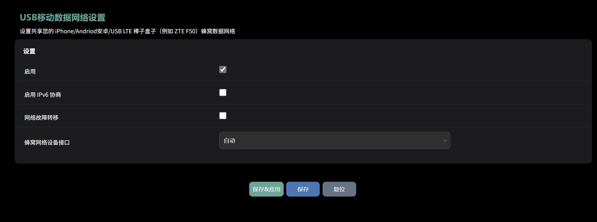

点击启用，蜂窝网络设备接口选择usb0，如果没有请选择新增加的eth接口（eth4[jdc01]）

点击保存&应用即可

### 手动连接

由于该插件在系统重启后，会清除该接口的所有配置，所以如果需要对接口特殊配置，请不要使用该插件，按照下方步骤添加接口

进入后台-网络-接口，点击添加新接口

新接口的名称：自行指定，不得与现有重复

新接口的协议：一般选择DHCP，如有特殊需求可选择静态地址

包含以下接口：选择usb0，如果没有请选择新增加的eth接口（eth4[jdc01]）

然后点击提交

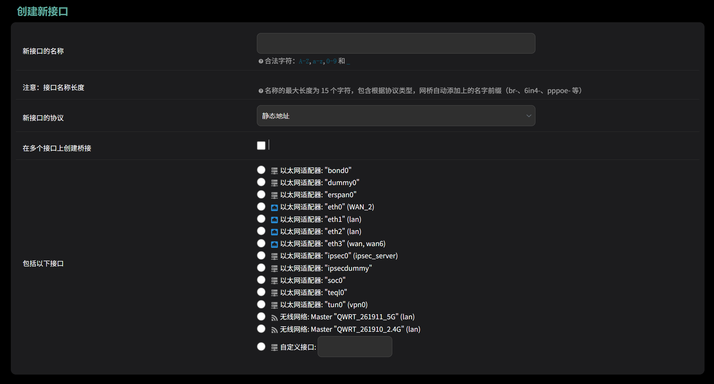

然后会自动跳转，点击配置DHCP服务器（使用静态地址请跳过）

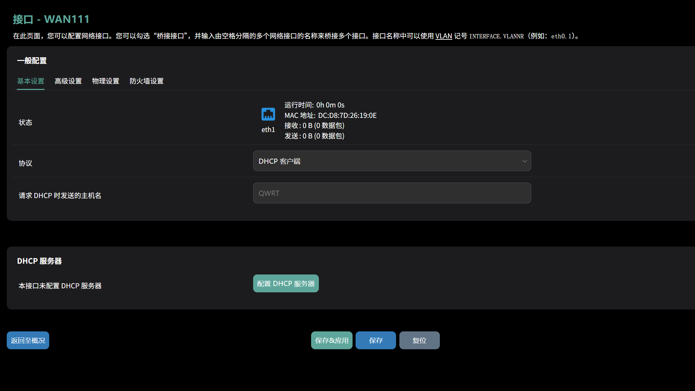

然后点击防火墙设置

选择wan，然后保存&应用

## 无线中继

无线中继操作期间，WIFI会断连，建议使用网线连接路由器进行设置

进入后台-网络-无线

点击扫描，上方wifi0对应扫描5GHz频段的wifi，下方wifi1对应扫描2.4GHz频段wifi

无线中继只能中继一个频段，两个频段都中继无效（似乎可以通过MWAN来实现中继两个频段（待验证））

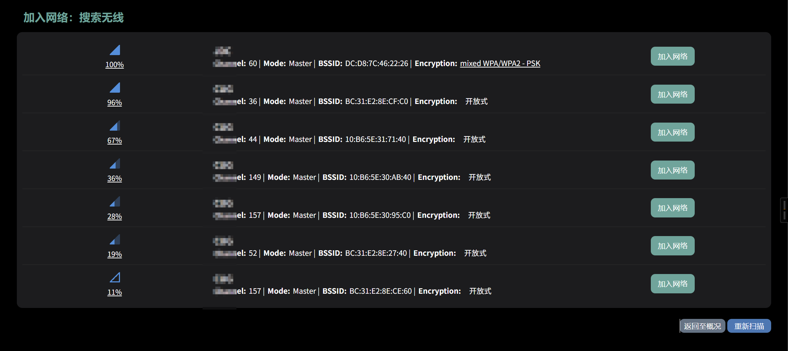

选择你需要中继的WIFI点击加入网络（如果没有找到，点击下方重新扫描，如果还是扫不到，可能是信号干扰，距离过远等原因导致）

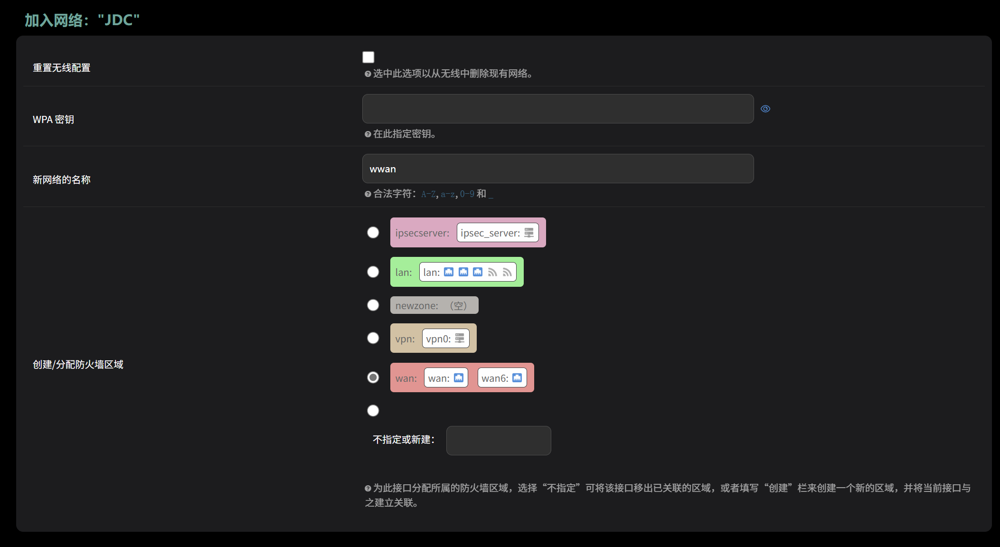

这一步默认即可，但是网络名称不要和已有的接口名重复（如你使用了随身wifi，默认接口名也是wwan与它重复），点击提交

然后在下一个界面中点击接口配置-无线安全，输入被中继WIFI的密码（开放式WIFI可忽略）

然后点击保存&应用，这样就完成了所有设置

## 安装 Argon 主题

进入后台-系统-软件包

先刷新列表然后在过滤器中搜索`luci-theme-argon`

然后你会看到一堆软件包，个人建议可以无脑选择`luci-theme-argonv3`其他版本可以自己试一试

安装完毕后，进入系统-系统-语言和界面

其中Design是默认主题，Argon_Dark和Argon_Light分别对应暗色和亮色主题，如果选择Argon会自适应选择暗色和亮色

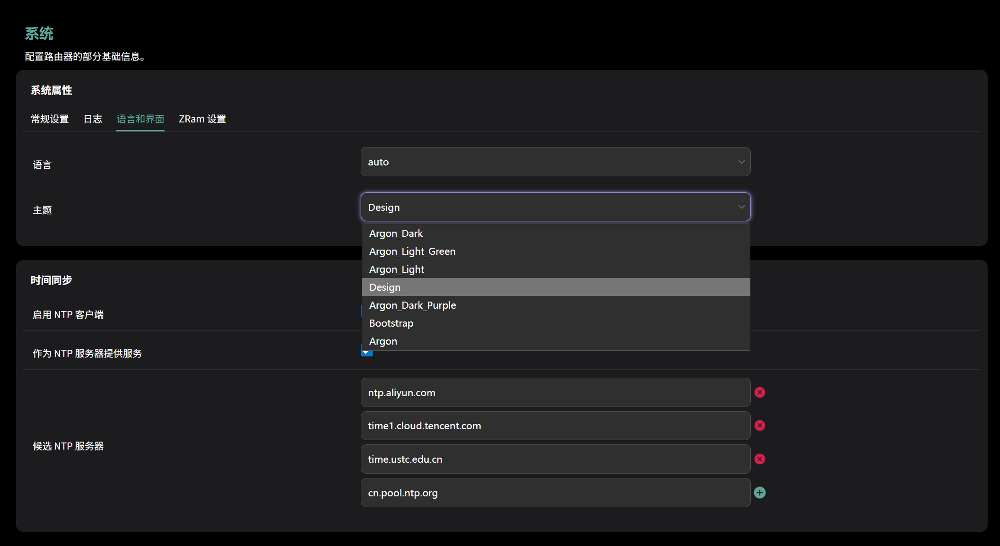

如果想要修改Argon主题设置，进入后台-系统-软件包安装`luci-app-argon-config`和`luci-i18n-argon-config-zh-cn`后就可以在系统-Argon 主题设置中修改

## 通过 IPK 文件安装软件包

进入后台-系统-文件传输

上传IPK文件

然后点击安装即可

## 修改路由器 DNS

路由器的 DNS 可分为上游DNS（即 WAN 口 DNS ）修改它会使得路由器和路由器下游设备均使用该DNS 和 下游 DNS（即 LAN 口 DNS）修改它会使得下游设备使用该 DNS 而路由器本身使用原DNS（一般为上游（如光猫）提供的 DNS）

### 1.修改 LAN 口 DNS

进入后台-网络-接口

编辑 LAN 口

在下图处填写你想要的 DNS 地址

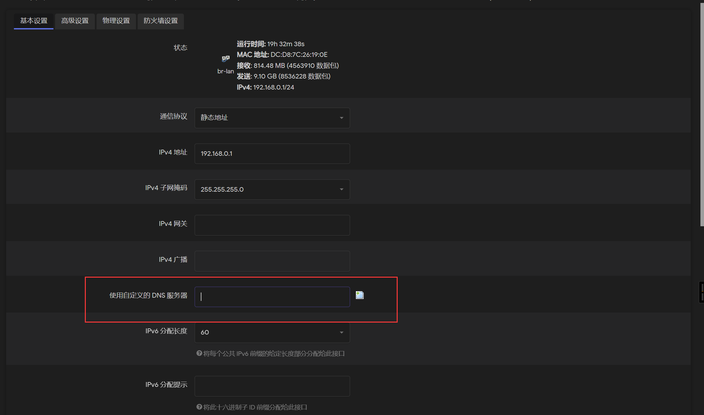

然后点击保存&应用即可

### 2.修改 WAN 口 DNS

进入后台-网络-接口

编辑 WAN 口，点击高级设置

取消勾选使用对端通告的 DNS 服务器，然后在下面的框中输入你想要的 DNS

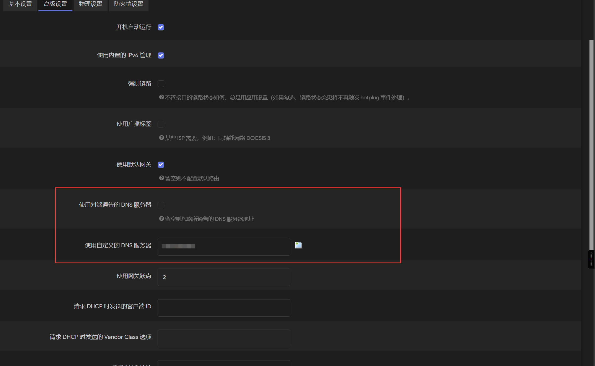

然后点击保存&应用即可
