# R3G 入门教程

## 后台密码及WIFI密码

R3G群内目前有两种固件，分别为Lede和Immortalwrt，默认预装Immortalwrt

Lede 版本 默认后台192.168.1.1

Immortalwrt 版本 默认后台192.168.7.1

账号：root

密码：88888888

WIFI密码：88888888

## 修改后台密码

登录后台-系统-管理权

输入新密码后保存即可

## 修改WIFI密码

登录后台-网络-无线

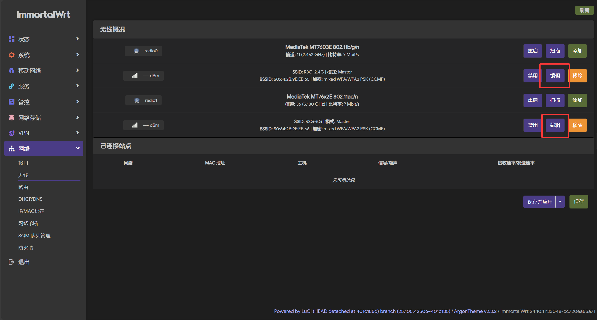

编辑-无线安全

加密模式选择WPA2-PSK 如需兼容老设备可以选择WPA-PSK/WPA2-PSK Mixed Mode

下方密钥处填写新密码，然后点击保存

保存后右上角会显示未保存的配置，点击并选择保存并应用才会生效（后台中很多操作都需要进行确认，点击恢复会还原设置前的配置）

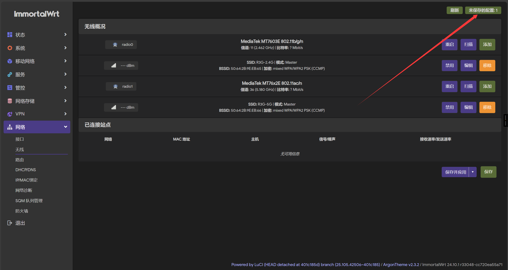

## 修改WIFI名称

进入后台-网络-无线

编辑 2.4GHz 和 5Ghz 的 WiFi ，ESSID即为WIFI名称

修改后保存并应用即可

## WIFI开启双频合一

进入后台-网络-无线

编辑 2.4GHz 和 5Ghz 的 WiFi ,将 ESSID 改为相同的名字，密码也改为相同的密码即可

## 修改后台登录地址

登录后台-网络-接口

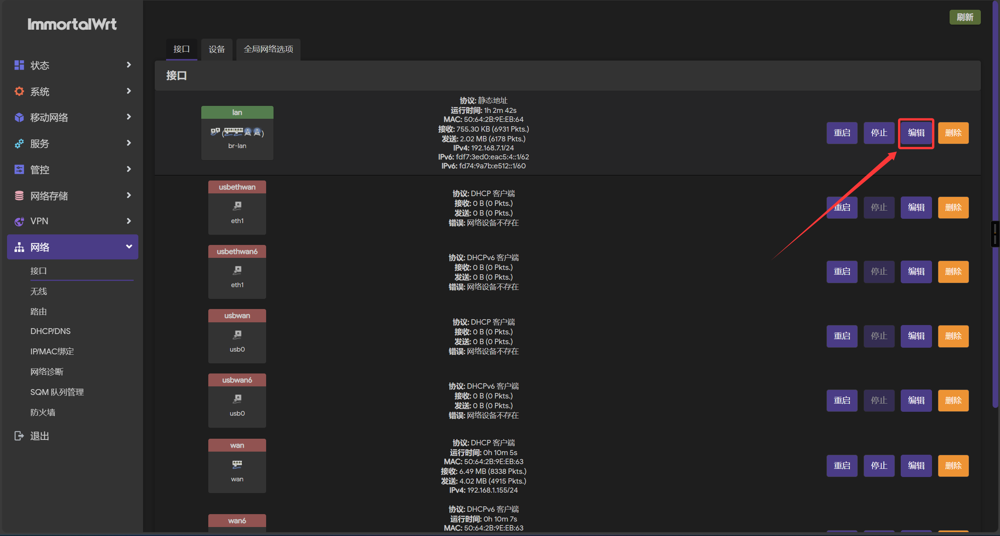

修改此处ip地址即可（建议设置格式：192.168.x.1）

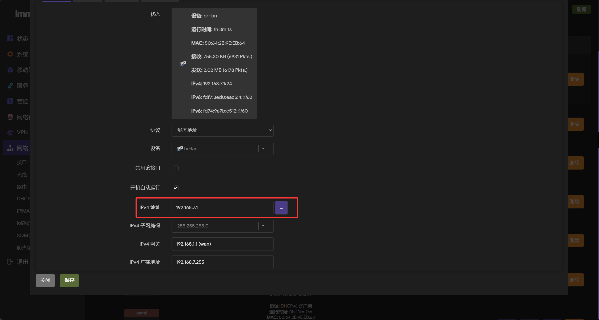

保存后，点击右上角未保存的配置，此处需要点击强制保存，否则会自动恢复

## 为某个设备设置静态IP地址

登录后台-网络-DHCP/DNS-静态地址分配-添加

最后保存，点击右上角未保存的配置，保存并应用

## 连接随身WIFI

将随身 WIFI 插入 USB 口

登录后台-网络-接口

看到 usbethwan 或 usbwan 获取到 ip 地址证明连上了

如果没有获取到，考虑连接线是否正常。如果还是不行多重启几次路由器和接口。如果还还还是不行，可能是供电不够，想办法改供电吧（这里不教，酷安有教程，改坏了自己负责）

## 连接4G/5G模块

R3G仅支持USB模式

将模块插入USB

登录后台-移动管理-模块管理

一般情况下首次插入模块需要在移动管理-模块管理-QModem 设置中手动扫描USB（勾选启用USB模组扫描后会在路由器开机的时候自动扫描）

然后回到模组信息页面，出现了基本信息(如下图)，就是连接上了

后续就自行摸索吧（我没有卡）

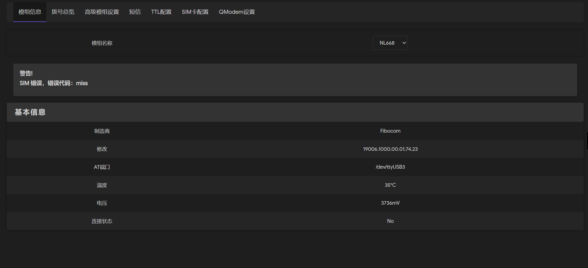

模块支持列表（仅供参考，以实际为准）：

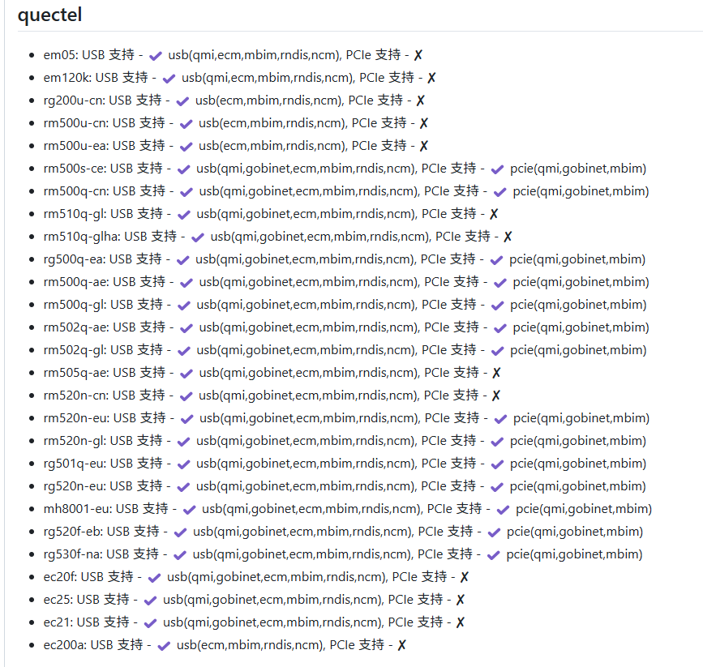

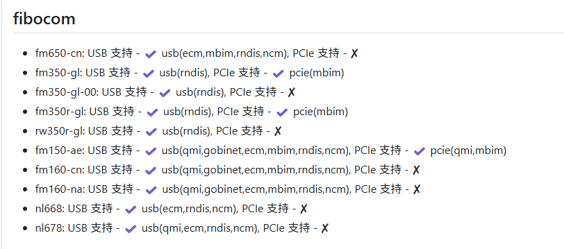

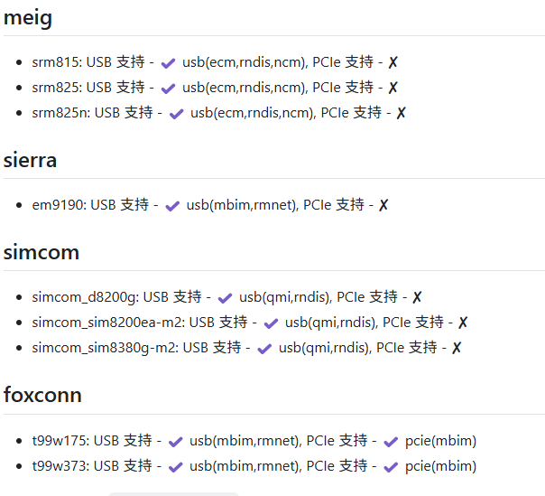

## 更新固件

!>**更新固件期间请勿断电**

先在群内下载好所需的固件（需使用文件名中带R3G的固件）

解压后，可以看到文件名末尾分别为 sysupgrade roofs0 kernel kernel1的4个文件

这里我们只需要sysupgrade这个文件

登录后台-系统-备份与升级-刷写与升级，上传sysupgrade这个文件后，点击继续，等待重启（保留配置选项正常升级可以勾选，但是如果需要降级可能需要取消勾选该选项）

## 通过breed进行刷机

breed刷机会清除所有配置，建议在上述更新方法无效时使用，同时如果使用上述方法刷机时意外断电，也可以使用本方法。

!>**breed刷机操作失误变砖的概率更大，请严格按照以下步骤执行**

!>**更新固件期间请勿断电**

将路由器断电，长按重置键（此按键仅可用于进入breed，重置功能已经失效了）并插上电源，等待5-10s。用网线将路由器Lan口与电脑连接，在浏览器中输入192.168.1.1进入后台。（如果无法进入请尝试手动设置网卡ip地址为192.168.1.x（2-255） 子网掩码为255.255.255.0 网关为192.168.1.1 DNS随意填写一个可用的DNS）

然后根据群文件中*R3G刷机教程.mp4*的步骤进行刷机

[R3G刷机教程](./Image/1-1.mp4 ':include :type=iframe width=640% height=400px')

## 使用PxxsWxxl OpenCxxxh等插件

相关内容此处不教，建议询问群友

## 设置WAN口上网方式

登录后台-网络-接口

下拉协议选项可以看到以下协议

DHCP客户端：通过DHCP协议自动获取ipv4，上游网关，dns等信息，并连接互联网

DHCPv6客户端：通过DHCP协议自动获取ipv6，上游网关，dns等信息，并连接互联网（请不要在此处选择，ipv6相关配置请在WAN6接口设置）

不配置协议：一般用不到

PPP和PPPoE协议不做介绍，需要使用的自行探索（实际上是我没用过）

静态地址：可以手动指定内网ip地址 子网掩码 网关等信息

按需设置后，保存并应用即可

## 修改路由器 DNS

路由器的 DNS 可分为上游DNS（即 WAN 口 DNS ）修改它会使得路由器和路由器下游设备均使用该DNS 和 下游 DNS（即 LAN 口 DNS）修改它会使得下游设备使用该 DNS 而路由器本身使用原DNS（一般为上游（如光猫）提供的 DNS）

### 1.修改 LAN 口 DNS

进入后台-网络-接口

编辑 LAN 口，点击高级设置

在下图处填写你想要的 DNS 地址

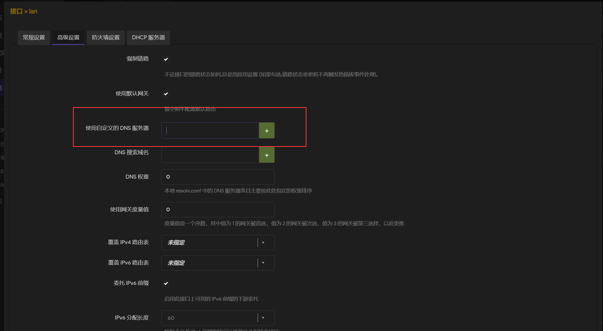

然后点击保存，再点击右上角的未保存的配置

然后点击保存并应用即可

### 2.修改 WAN 口 DNS

进入后台-网络-接口

编辑 WAN 口，点击高级设置

取消勾选自动获取 DNS 服务器

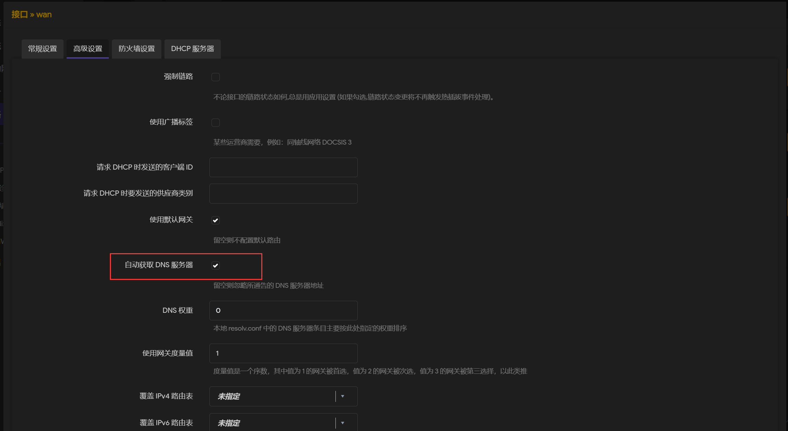

然后在下图框中填写你想要的 DNS 地址

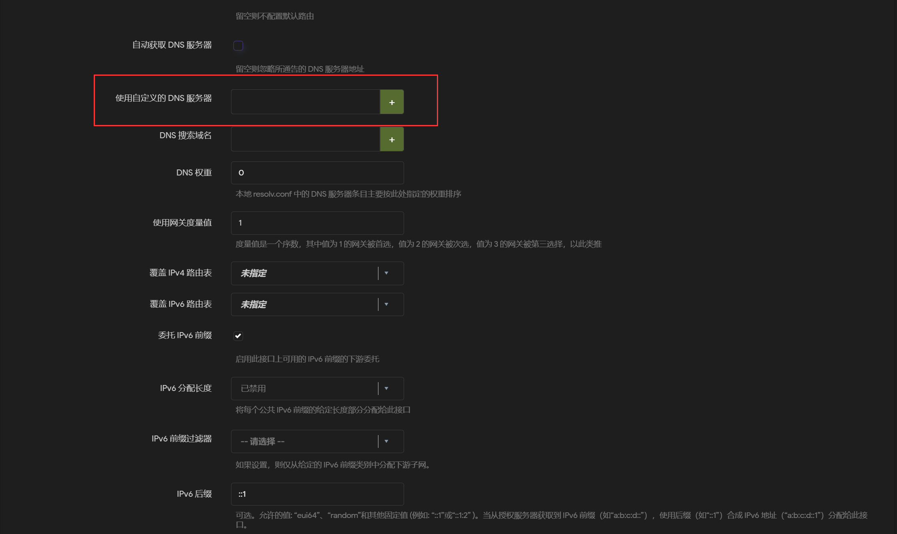

最后点击保存，再点击右上角的未保存的配置

然后点击保存并应用即可